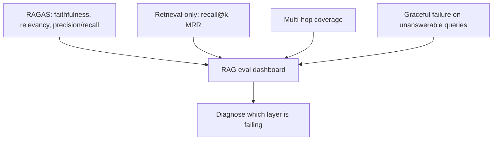

March's RAGAS post covered faithfulness, answer relevancy, and context precision/recall — a strong default toolkit. This month's broader evaluation toolkit adds dimensions RAGAS alone doesn't fully capture, particularly around retrieval quality independent of generation.



RAGAS's blended metrics tell you quality dropped; the layers added here — isolated retrieval, multi-hop coverage, and graceful failure on unanswerable questions — tell you which specific stage of the pipeline is responsible.

## Retrieval-Only Metrics, Isolated from Generation

RAGAS's context metrics blend retrieval and generation quality in ways that can obscure which stage is actually failing. Isolate retrieval evaluation completely:

```python
def evaluate_retrieval_only(retriever, eval_queries: list[dict], k: int = 5) -> dict:
    recall_hits, mrr_scores = 0, []
    for item in eval_queries:
        results = retriever.search(item["query"], top_k=k)
        result_ids = [r.id for r in results]
        if item["correct_doc_id"] in result_ids:
            recall_hits += 1
            mrr_scores.append(1 / (result_ids.index(item["correct_doc_id"]) + 1))
        else:
            mrr_scores.append(0)
    return {"recall_at_k": recall_hits / len(eval_queries), "mrr": mean(mrr_scores)}
```

This directly informs the embedding fine-tuning decision from May — if recall@k is the bottleneck, generation-side prompt tweaks won't fix the underlying problem.

## Multi-Hop and Compositional Query Evaluation

RAGAS's standard metrics assume a single retrieval step answers the question well. Multi-turn RAG and agentic retrieval (from April) need evaluation of whether the *sequence* of retrievals, not just any single one, covers what's needed:

```python
def evaluate_multi_hop(trace: dict, required_facts: list[str]) -> float:
    all_retrieved_context = " ".join(step["retrieved_text"] for step in trace["retrieval_steps"])
    covered = sum(1 for fact in required_facts if fact_is_covered(fact, all_retrieved_context))
    return covered / len(required_facts)
```

## Evaluating Failure Gracefully: The "No Answer" Case

A RAG system should recognize when retrieved context genuinely doesn't answer the question, and say so rather than fabricating an answer from irrelevant context. This needs a dedicated test slice of unanswerable questions in the golden set:

```python
unanswerable_test_cases = [
    {"query": "What's our refund policy for a product we don't sell?", "expected_behavior": "acknowledge_no_answer"}
]

def evaluate_graceful_failure(response: str) -> bool:
    return not confidently_answers(response) and acknowledges_uncertainty(response)
```

A RAG system that scores well on faithfulness and relevancy for answerable questions but confidently fabricates on unanswerable ones has a real, dangerous gap that standard RAGAS metrics won't surface unless you specifically test for it.

## Freshness and Staleness Evaluation

For knowledge bases that update over time, add a check for whether retrieval surfaces the most current version of a fact when multiple versions exist in the index — a common silent failure mode where an outdated document outranks its replacement due to embedding similarity alone, with no awareness of recency.

## Bringing It Together in a RAG Eval Dashboard

Combine RAGAS's generation-focused metrics with these retrieval-isolated, multi-hop, and graceful-failure checks into one dashboard, sliced by query type — this is what lets you diagnose precisely which layer of a RAG system needs attention rather than just knowing "quality is down."

---

*Part of the [Evaluation series]({{ site.baseurl }}/tags/evaluation-series/) — next: [evaluating agentic workflows]({{ site.baseurl }}/posts/evaluating-agentic-workflows-task-success/) in more depth, revisiting March's agent evaluation post with this month's fuller toolkit.*
