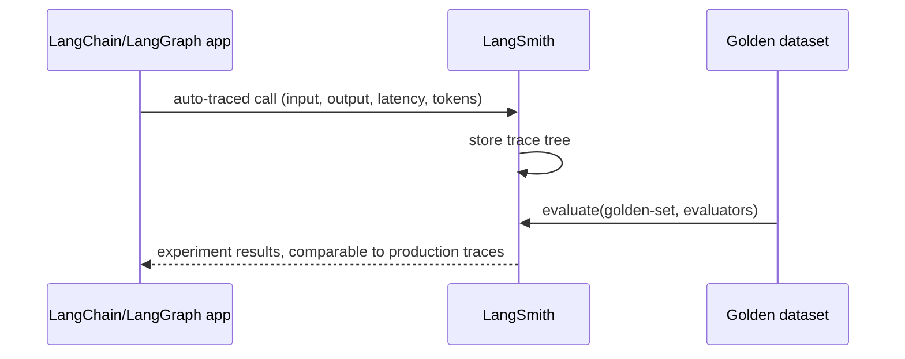

DeepEval focuses on the evaluation layer. LangSmith (from the LangChain team) combines that with full production tracing — every LLM call, tool invocation, and chain step captured automatically, with evaluation built on top of the same trace data.



The same platform that captures what actually happened in production also runs golden-set experiments against traced data, and a real production trace can be promoted directly into that golden dataset — closing the loop without manual re-entry.

## Automatic Tracing with Minimal Instrumentation

```python
import os
os.environ["LANGCHAIN_TRACING_V2"] = "true"
os.environ["LANGCHAIN_PROJECT"] = "support-agent-prod"

# Any LangChain or LangGraph call is now automatically traced — no extra code needed
result = agent_graph.invoke({"messages": [{"role": "user", "content": "My deployment is stuck"}]})
```

For non-LangChain code, the `@traceable` decorator gets the same effect:

```python
from langsmith import traceable

@traceable(name="research_step")
def research(query: str) -> str:
    results = search_tool(query)
    return synthesize(results)
```

## Reading a Trace

Every traced run produces a hierarchical view — the full input/output at each step, latency per step, token usage, and any errors — directly matching the trace-step structure from April's agent-debugging post, but rendered as an inspectable UI tree rather than a manually-built log.

## Running Evaluations Against Traced Data

```python
from langsmith.evaluation import evaluate

def faithfulness_evaluator(run, example) -> dict:
    score = measure_faithfulness(run.outputs["answer"], example.inputs["context"])
    return {"key": "faithfulness", "score": score}

results = evaluate(
    lambda inputs: agent_graph.invoke(inputs),
    data="golden-set-v3",  # a dataset uploaded to LangSmith
    evaluators=[faithfulness_evaluator],
    experiment_prefix="prompt-v4-test",
)
```

This ties the golden-set-based regression testing pattern directly to production trace infrastructure — the same platform that captured what actually happened in production can also run your golden set experiments, with both showing up in comparable dashboards.

## Dataset Curation from Production Traces

Because every production run is already traced, LangSmith makes it straightforward to promote a real production trace directly into a golden dataset — closing the loop from the golden-dataset post's "real production failures" sourcing strategy without manual data re-entry:

```python
langsmith_client.create_example(
    inputs=problematic_run.inputs,
    outputs={"expected_behavior": "should have escalated, did not"},
    dataset_name="golden-set-v3",
)
```

## Monitoring Dashboards

Beyond individual trace inspection, LangSmith aggregates latency, cost, and error rate trends across a deployment over time — the production monitoring layer this month's CI-focused posts have been building toward, covered in full in the dedicated dashboards post later this month.

## Where LangSmith Fits If You're Not Using LangChain

Tracing and evaluation value isn't exclusive to LangChain-based stacks — the `traceable` decorator and evaluation API work with any Python code. The tightest integration and lowest setup cost is with LangChain/LangGraph specifically; teams on other frameworks should weigh it against the vendor-neutral alternatives covered in the next two posts.

---

*Part of the [Evaluation series]({{ site.baseurl }}/tags/evaluation-series/) — next: [Langfuse]({{ site.baseurl }}/posts/langfuse-open-source-observability/), the leading open-source, self-hostable alternative.*
