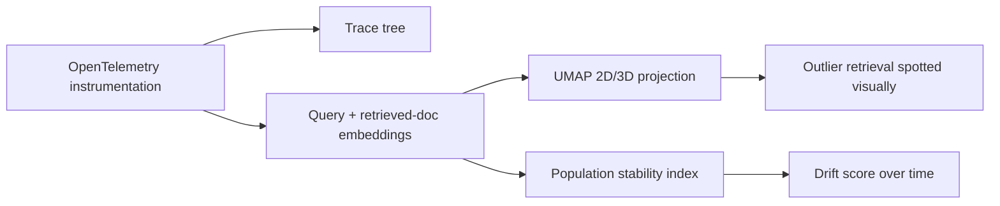

Arize Phoenix comes from an ML observability background, and it shows in its strengths — it's the option in this comparison most focused on embedding-space analysis and drift detection, on top of the same tracing capability the last two posts covered.



Where LangSmith and Langfuse center on the trace tree, Phoenix's distinctive strength is projecting embeddings into a visual space — an outlier retrieval becomes visible as a stray point rather than something you'd have to catch example-by-example in faithfulness scores.

## Tracing with OpenTelemetry

Phoenix is built on OpenTelemetry, the vendor-neutral tracing standard — meaning instrumentation isn't proprietary to Phoenix and can be redirected to other OTel-compatible backends later without rewriting instrumentation code:

```python
from phoenix.otel import register
from openinference.instrumentation.openai import OpenAIInstrumentor

tracer_provider = register(project_name="support-agent")
OpenAIInstrumentor().instrument(tracer_provider=tracer_provider)

# Every OpenAI call anywhere in the codebase is now automatically traced
```

## Embedding Visualization: Phoenix's Distinctive Feature

Where Langfuse and LangSmith focus on trace trees, Phoenix's UMAP-based embedding visualization lets you see retrieved-document clusters and query embeddings in a 2D/3D projection — genuinely useful for diagnosing a specific class of RAG failure that's hard to spot from trace text alone:

```python
from phoenix.trace import using_project

with using_project("support-agent"):
    query_embedding = embed(user_query)
    retrieved_embeddings = [embed(doc) for doc in retrieved_docs]
    # Phoenix's UI clusters these visually — outlier retrievals become visually obvious
```

A retrieved document that's a clear outlier in embedding space relative to the query — visible as a point far from the query's cluster in the projection — is a fast visual signal for "the retriever pulled something irrelevant," faster to spot than reading through faithfulness scores example by example.

## Drift Detection

Phoenix's ML-observability roots make it well-suited to detecting distributional drift — is the *shape* of incoming queries or the *shape* of retrieved context changing over time, independent of any single quality score:

```python
from phoenix.metrics.drift import population_stability_index

drift_score = population_stability_index(
    baseline_embeddings=last_month_query_embeddings,
    current_embeddings=this_week_query_embeddings,
)
```

This connects directly to tomorrow's post on detecting prompt and model behavior drift — Phoenix's embedding-drift tooling is one concrete implementation of that broader concern, specifically for the *input distribution* side of drift rather than model behavior itself.

## Running Evaluations

```python
from phoenix.evals import HallucinationEvaluator, run_evals

evaluator = HallucinationEvaluator(model=eval_model)
results = run_evals(dataframe=traces_df, evaluators=[evaluator], provide_explanation=True)
```

Phoenix's built-in evaluators cover the same hallucination, relevance, and toxicity categories as the hand-rolled and DeepEval versions from earlier this month, with results that integrate directly into the same trace and embedding visualization UI.

## Choosing Phoenix Specifically

Reach for Phoenix over Langfuse or LangSmith when embedding-space debugging and drift detection are a priority — particularly relevant for RAG-heavy systems where retrieval quality issues are the dominant failure mode, and less differentiated for primarily agentic or non-retrieval workloads where the other two platforms' trace-centric UIs are equally strong.

---

*Part of the [Evaluation series]({{ site.baseurl }}/tags/evaluation-series/) — next: [Helicone]({{ site.baseurl }}/posts/helicone-lightweight-request-logging/), for teams that want request logging without a full observability platform's setup cost.*
