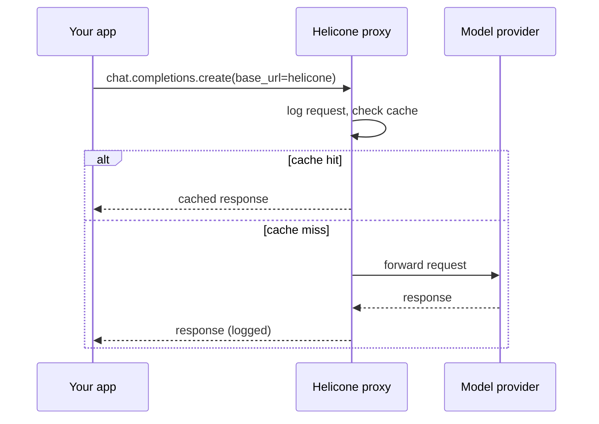

The last three posts covered full observability platforms with real setup and conceptual overhead — projects, tracing SDKs, dashboards to configure. Helicone takes a deliberately lighter-weight approach: a proxy in front of your existing API calls, with essentially zero code change required to get request-level logging.



Just changing the client's base URL routes every call through the proxy, which logs, optionally caches, and can rate-limit — the tradeoff is a flat request log rather than the structured, related-calls trace tree the full platforms build.

## The Proxy Pattern

Instead of instrumenting your code with decorators or SDK calls, you route requests through Helicone's proxy by changing the base URL:

```python
from openai import OpenAI

client = OpenAI(
    base_url="https://oai.helicone.ai/v1",
    default_headers={"Helicone-Auth": f"Bearer {HELICONE_API_KEY}"},
)

# Every call through this client is automatically logged — no other code changes
response = client.chat.completions.create(model="gpt-4.1", messages=[...])
```

This is the fastest path to *any* observability for a codebase with existing direct API calls scattered across the app — no refactor to add tracing calls everywhere, just a base URL change at the client construction point.

## Custom Properties for Filtering

```python
response = client.chat.completions.create(
    model="gpt-4.1",
    messages=[...],
    extra_headers={
        "Helicone-Property-Feature": "support-agent",
        "Helicone-Property-UserId": user_id,
        "Helicone-Property-Environment": "production",
    },
)
```

Custom properties let you slice the request log dashboard by feature, user, or environment after the fact — a lightweight substitute for the structured trace metadata the fuller platforms capture natively.

## Caching Built Into the Proxy

Because Helicone sits in the request path as a proxy, it can transparently cache responses for identical requests — directly implementing the semantic/exact caching pattern that'll get fuller treatment in August's infrastructure series, with zero application-level caching code:

```python
response = client.chat.completions.create(
    model="gpt-4.1",
    messages=[...],
    extra_headers={"Helicone-Cache-Enabled": "true"},
)
```

## Rate Limiting and Cost Alerts

```python
# Configured via the Helicone dashboard, not code:
# - Alert when daily spend exceeds $500
# - Rate limit a specific user or API key to 100 requests/hour
```

This gives you a chunk of the cost-monitoring functionality from two posts ahead, without building custom budget-tracking infrastructure — appropriate for teams that want the guardrail without the engineering investment of a bespoke solution.

## What You Give Up for the Simplicity

Helicone's request-level logging doesn't natively capture the internal step-by-step structure of a multi-step agent or chain the way LangSmith, Langfuse, or Phoenix trace trees do — you see each individual API call, not necessarily how they relate to each other within one logical agent run, unless you thread correlation IDs through the custom properties yourself.

## When Helicone Is the Right Choice

Choose Helicone when you want request-level cost, latency, and caching visibility with near-zero setup cost, especially for simpler, non-agentic LLM integrations. Move to a full tracing platform once your system's complexity — multi-step agents, complex chains — makes understanding the *relationship* between calls as important as understanding each call individually.

---

*Part of the [Evaluation series]({{ site.baseurl }}/tags/evaluation-series/) — next: [structuring traces for multi-step agent debugging]({{ site.baseurl }}/posts/structuring-traces-multi-step-debugging/), the deeper pattern the platforms above are all built to support.*
