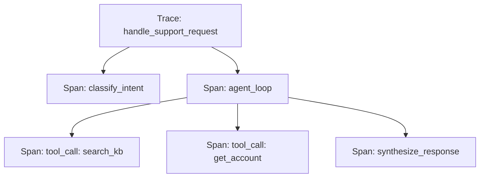

Every platform covered this week gives you somewhere to send trace data. This post is about what makes a trace *structure* actually useful for debugging, independent of which platform ends up storing it — the difference between a trace you can diagnose from and one that's just a wall of logged text.

## Span Hierarchy: Nesting Reflects Causality



A flat log of everything that happened, in call order, forces a reader to manually reconstruct which calls were nested inside which — a properly nested span hierarchy encodes that structure directly, so "what did the agent do to answer this" is a tree you can expand, not a transcript you have to mentally parse.

```python
from opentelemetry import trace
tracer = trace.get_tracer(__name__)

def handle_support_request(message: str) -> str:
    with tracer.start_as_current_span("handle_support_request") as root:
        intent = classify_intent(message)  # its own child span
        with tracer.start_as_current_span("agent_loop"):
            for step in agent.run_steps(message):
                with tracer.start_as_current_span(f"tool_call:{step.tool_name}"):
                    execute(step)
```

## What Every Span Needs to Carry

```python
@dataclass
class SpanAttributes:
    input_summary: str       # not the full raw input if huge — a bounded summary
    output_summary: str
    latency_ms: float
    token_usage: dict | None
    error: str | None
    metadata: dict           # model version, prompt version, user_id, request_id
```

`metadata` carrying prompt and model *version*, not just the model name, is what makes a trace useful for correlating "this specific run behaved oddly" back to "which exact prompt was live at that timestamp" — without it, a bug tied to a since-reverted prompt version becomes unreproducible.

## Correlation IDs Across System Boundaries

For a request that crosses services — a web request triggering an agent run that calls out to a separate retrieval service — propagate one correlation ID through every hop, so a single trace ID can pull the full picture across otherwise-separate logging systems:

```python
def make_downstream_request(payload: dict, trace_id: str):
    headers = {"X-Trace-Id": trace_id}
    return requests.post(retrieval_service_url, json=payload, headers=headers)
```

## Redacting Sensitive Data at Trace Time, Not After

Traces routinely capture user input and model output verbatim, which means they routinely capture PII — apply redaction at the point of span creation, not as a later cleanup pass over already-stored trace data:

```python
def redact_before_logging(text: str) -> str:
    return pii_scrubber.redact(text)  # the same tooling from September's security series
```

## Sampling Strategy for High-Volume Systems

Tracing every single request in full detail doesn't scale cost-wise at high volume. A common pattern: trace 100% of requests at a lightweight summary level (latency, success/fail, cost) and full detailed tracing only for a sample, plus always for anything that errored or was flagged by an evaluator — mirroring the strategic sampling approach from this month's human-evaluation post.

---

*Part of the [Evaluation series]({{ site.baseurl }}/tags/evaluation-series/) — next: [detecting prompt and model behavior drift]({{ site.baseurl }}/posts/detecting-prompt-model-behavior-drift/), one of the things well-structured traces make possible to catch.*
