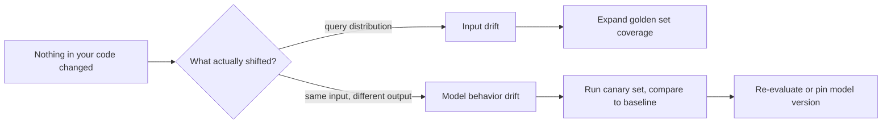

A prompt and model that scored well in last month's evaluation can silently degrade in production without anyone changing a line of code — a provider updates a model behind a stable API name, or the shape of real user queries shifts. Drift detection is what catches this before a golden-set-only evaluation practice would.



Both kinds of drift can degrade quality with zero code changes on your side, but they need different detection and different fixes — a canary set catches a provider silently updating a model, while an embedding-centroid check catches a shift in what users are even asking.

## Two Sources of Drift

- **Input drift** — the distribution of what users are asking has shifted (new use case, seasonal pattern, a marketing campaign driving different traffic) — Phoenix's embedding-drift tooling from earlier this week targets this directly
- **Model behavior drift** — the same input now produces different output, because the underlying model changed, even though your code and prompt didn't

## Detecting Model Behavior Drift with a Canary Set

```python
def check_model_drift(canary_examples: list[dict], previous_outputs: dict) -> dict:
    current_outputs = {ex["id"]: run(ex["input"]) for ex in canary_examples}
    drifted = [
        {"id": eid, "similarity": semantic_similarity(embed(previous_outputs[eid]), embed(current_outputs[eid]))}
        for eid in current_outputs
        if semantic_similarity(embed(previous_outputs[eid]), embed(current_outputs[eid])) < DRIFT_THRESHOLD
    ]
    return {"drifted_count": len(drifted), "examples": drifted}
```

Run a fixed set of canary examples through the *same* model endpoint on a regular schedule (daily, or after any provider-announced update) and compare outputs to a stored baseline — a meaningful drop in similarity on stable inputs, with nothing on your side having changed, is the signature of the provider having quietly updated the model.

## Tracking Distributional Shift in Input

```python
def detect_input_drift(recent_queries: list[str], baseline_queries: list[str]) -> float:
    recent_embeddings = [embed(q) for q in recent_queries]
    baseline_embeddings = [embed(q) for q in baseline_queries]
    recent_centroid = np.mean(recent_embeddings, axis=0)
    baseline_centroid = np.mean(baseline_embeddings, axis=0)
    return cosine_distance(recent_centroid, baseline_centroid)
```

A rising trend in this distance over successive weeks is an early warning that your golden dataset's coverage is aging — the trigger for adding new categories to the golden set, closing the loop back to that post's "keep it alive, not frozen" guidance.

## Watching Production Metric Trends, Not Just Point-in-Time Checks

```python
def weekly_drift_report(metric_history: list[dict]) -> dict:
    recent_avg = mean(m["faithfulness"] for m in metric_history[-7:])
    baseline_avg = mean(m["faithfulness"] for m in metric_history[-30:-7])
    return {"trend": recent_avg - baseline_avg, "alert": recent_avg < baseline_avg - 0.05}
```

A single day's quality dip is often noise; a sustained downward trend across a week against the trailing month's baseline is a much more reliable drift signal, and it's what a dashboard (covered in two posts) should surface prominently rather than raw daily numbers.

## What to Do When Drift Is Detected

Model behavior drift usually means re-running your full evaluation suite against the current model version and, if quality has genuinely regressed, either pinning to a specific model version (where the provider allows it) or adjusting the prompt to compensate. Input drift means expanding golden set coverage and potentially retraining or re-evaluating fine-tuned models against the new distribution, closing back to May's continual fine-tuning post.

---

*Part of the [Evaluation series]({{ site.baseurl }}/tags/evaluation-series/) — next: [cost monitoring and budget alerts]({{ site.baseurl }}/posts/cost-monitoring-budget-alerts-llm/), the other production signal worth watching continuously.*
