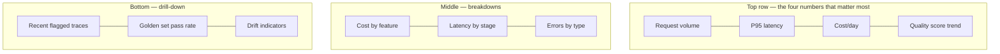

Cost, latency, and quality have each had their own post this month. A production application needs all three visible in one place, at a glance, for whoever's on call or reviewing product health — this post is about assembling them into a dashboard that actually gets looked at.

## The Core Layout



## What Belongs on Every LLM Application Dashboard

- **Volume and error rate** — the basics any service dashboard needs, unchanged from traditional software
- **Latency percentiles per stage** — from yesterday's post, not just an aggregate number
- **Cost per day, broken down by feature** — from two posts ago, trended over time
- **Quality score trend** — faithfulness, task success rate, or whatever your primary metric is, sampled continuously from production, not just golden-set runs
- **Drift indicators** — the canary-set similarity score and input-distribution shift from Wednesday's post
- **Recent flagged traces** — a live feed of the lowest-scoring recent examples, for fast investigation

## Building It Practically

```python
def compute_dashboard_metrics(window_hours: int = 24) -> dict:
    traces = get_traces(since=now() - timedelta(hours=window_hours))
    return {
        "volume": len(traces),
        "error_rate": sum(1 for t in traces if t["status"] == "error") / len(traces),
        "latency": latency_summary([t["total_ms"] for t in traces]),
        "cost_today": sum(t["cost_usd"] for t in traces),
        "quality_trend": rolling_average([t["quality_score"] for t in traces], window=6),
        "lowest_scoring": sorted(traces, key=lambda t: t["quality_score"])[:10],
    }
```

Most of the observability platforms from earlier this week (Langfuse, LangSmith, Phoenix, Helicone) provide dashboard UIs out of the box covering much of this — building a fully custom dashboard is worth doing when you need to combine LLM-specific metrics with other business metrics (conversion, retention) in one unified view those platforms don't natively track.

## Designing for the Person Actually Looking at It

A dashboard with forty metrics on it gets glanced at once and ignored. The top row should be the four or five numbers that, if any one of them moves meaningfully, someone should actually do something — everything else belongs one click deeper, not competing for attention on first load.

## Alerting vs Dashboards: Different Jobs

A dashboard is for exploration and periodic review; alerting is for "someone needs to know right now." Don't rely on someone noticing a dashboard trend — the anomaly detection from the cost-monitoring post and the SLO burn-rate alerting from the latency post should page or notify directly, with the dashboard serving as the place you go *after* an alert to understand context, not the primary detection mechanism.

---

*Part of the [Evaluation series]({{ site.baseurl }}/tags/evaluation-series/) — next: [shadow testing new prompts]({{ site.baseurl }}/posts/shadow-testing-prompts-production-traffic/) against real production traffic before it ever affects users.*
