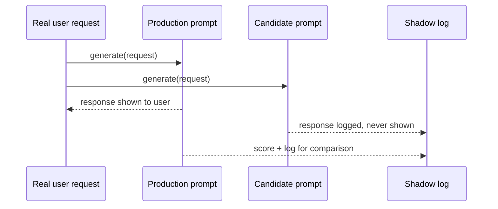

April's production deployment post introduced shadow mode for agents — running a new version against real traffic without letting it affect real outcomes. This is that same pattern, applied specifically to evaluating a candidate prompt or model change before it ever reaches a real user.



Both variants run against the same real request, but only production's output is ever returned — the candidate's score is purely observational, which is what lets shadow testing surface real-traffic regressions with zero risk before a candidate ever reaches an actual A/B test.

## The Shadow Testing Loop

```python
def shadow_test_prompt(request: dict, production_prompt: str, candidate_prompt: str):
    production_response = generate(production_prompt, request)  # this is what the user actually sees
    candidate_response = generate(candidate_prompt, request)     # this is logged, never shown

    log_shadow_comparison({
        "request": request,
        "production_output": production_response,
        "candidate_output": candidate_response,
        "production_score": score_response(production_response, request),
        "candidate_score": score_response(candidate_response, request),
    })
    return production_response  # only the production response is ever returned to the user
```

Running both in parallel against the *same* real request, not a golden set proxy, is what makes shadow testing catch issues a static evaluation set structurally can't — the full messy diversity of real production input, including cases nobody thought to add to the golden set.

## Aggregating Shadow Results Before Deciding

```python
def summarize_shadow_test(comparisons: list[dict]) -> dict:
    prod_scores = [c["production_score"] for c in comparisons]
    candidate_scores = [c["candidate_score"] for c in comparisons]
    wins = sum(1 for c in comparisons if c["candidate_score"] > c["production_score"])
    return {
        "candidate_win_rate": wins / len(comparisons),
        "avg_score_delta": mean(candidate_scores) - mean(prod_scores),
        "candidate_regressions": [c for c in comparisons if c["candidate_score"] < c["production_score"] - 0.2],
    }
```

Surface the specific regressions, not just the aggregate win rate — a candidate that wins on average but introduces a new, severe failure mode on a subset of traffic needs that subset examined before shipping, exactly the same principle as the CI regression gate from earlier this month.

## Cost of Shadow Testing

Running two full generations per request roughly doubles inference cost for the duration of the shadow test — budget for this explicitly and run shadow tests for a bounded window (enough real traffic diversity to be statistically meaningful, not indefinitely) rather than leaving shadow mode running as a permanent default.

## Shadow Testing vs A/B Testing: When to Use Which

Shadow testing never affects real users — safest option, but you only get automated/proxy quality signals, not real user behavior (regeneration rate, task completion) since the candidate's output is never actually shown. A/B testing from earlier this month exposes real users to the candidate and captures genuine behavioral signal, at real risk if the candidate is worse. The natural sequence: shadow test first to catch obvious regressions cheaply, then A/B test the surviving candidates to validate real-world impact.

## Automating the Shadow-to-Canary Pipeline

```python
def shadow_test_gate(comparisons: list[dict], min_win_rate: float = 0.55) -> bool:
    summary = summarize_shadow_test(comparisons)
    return summary["candidate_win_rate"] >= min_win_rate and len(summary["candidate_regressions"]) == 0
```

A candidate that clears this gate is a reasonable one to promote to a small-percentage A/B test or canary rollout — shadow testing's job is filtering out the clearly-worse candidates cheaply before they ever risk real user exposure.

---

*Part of the [Evaluation series]({{ site.baseurl }}/tags/evaluation-series/) — next: [canary releases]({{ site.baseurl }}/posts/canary-releases-llm-features/) for the rollout stage that follows a successful shadow test.*
