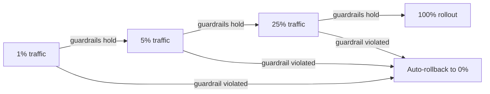

Shadow testing validates a candidate against real traffic with zero user impact. Canary release is the next step: real users, real impact, but deliberately limited in blast radius and instrumented for fast rollback — the bridge between shadow testing and a full rollout.



Starting at 1%, not 10%, matters specifically for LLM features — a bad prompt or model regression can affect every request it touches — and the rollback at any stage has to be a fast feature-flag flip, not a redeploy, since it needs to bound damage within minutes.

## Canary Rollout Stages

```python
canary_stages = [
    {"pct": 1, "min_duration_hours": 4, "guardrail_check": "every_30_min"},
    {"pct": 5, "min_duration_hours": 12, "guardrail_check": "every_hour"},
    {"pct": 25, "min_duration_hours": 24, "guardrail_check": "every_hour"},
    {"pct": 100, "min_duration_hours": None, "guardrail_check": "standard_monitoring"},
]

def advance_canary(current_stage: int, guardrail_status: dict) -> int:
    if guardrail_status["violated"]:
        return -1  # signal: roll back immediately
    if elapsed_since_stage_start() >= canary_stages[current_stage]["min_duration_hours"]:
        return current_stage + 1
    return current_stage
```

Starting at 1%, not 10%, matters specifically for LLM features — a genuinely bad prompt or model regression can affect every single request it touches, unlike a traditional software bug that might only trigger on specific code paths. A small blast radius limits real damage while you're still confirming the guardrails hold.

## Guardrails That Trigger Automatic Rollback

```python
def check_canary_guardrails(canary_metrics: dict, baseline_metrics: dict) -> dict:
    violations = []
    if canary_metrics["error_rate"] > baseline_metrics["error_rate"] * 1.5:
        violations.append("error_rate")
    if canary_metrics["p95_latency"] > baseline_metrics["p95_latency"] * 1.3:
        violations.append("latency")
    if canary_metrics["quality_score"] < baseline_metrics["quality_score"] - 0.05:
        violations.append("quality")
    if canary_metrics["cost_per_request"] > baseline_metrics["cost_per_request"] * 2:
        violations.append("cost")
    return {"violated": len(violations) > 0, "reasons": violations}
```

These are the same guardrail-metric categories from June's A/B testing post, applied here as automatic rollback triggers rather than manual review criteria — a canary system should be able to revert itself within minutes of a guardrail violation, without waiting for a human to notice a dashboard.

## Automatic Rollback Implementation

```python
def rollback_canary(feature_flag: str):
    set_feature_flag_percentage(feature_flag, 0)
    alert_on_call(f"Canary for {feature_flag} auto-rolled-back due to guardrail violation")
    log_incident(feature_flag, trigger="automatic_canary_rollback")
```

The rollback needs to be a fast, low-latency operation — a feature flag percentage change, not a new deployment — since deployment-based rollback is too slow to bound damage during an active guardrail violation.

## Segment-Aware Canaries

For features where risk varies by user segment, canary internal/beta users first, before any external production traffic, and consider canarying by geography or account tier to limit exposure of a genuinely severe issue to your highest-value customers:

```python
def canary_eligible(user: dict, stage: dict) -> bool:
    if stage.get("internal_only") and not user["is_internal"]:
        return False
    return hash(user["id"]) % 100 < stage["pct"]
```

## The Discipline This Requires Upstream

None of this works without the observability infrastructure from earlier this month already in place — real-time quality scoring, latency percentiles, and cost tracking all need to exist and be trustworthy *before* a canary rollout can safely auto-advance or auto-rollback based on them.

---

*Part of the [Evaluation series]({{ site.baseurl }}/tags/evaluation-series/) — next: [evaluating multi-turn conversation quality]({{ site.baseurl }}/posts/evaluating-multi-turn-conversation-quality/), a dimension none of this month's single-turn metrics fully capture.*
