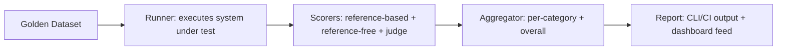

DeepEval, LangSmith, Langfuse, and Phoenix each package different subsets of this month's techniques. This post builds a minimal but complete internal eval harness from scratch — useful directly for smaller projects, and useful as a reference for understanding what any of those platforms are actually doing underneath their APIs.

## Architecture



## The Core Data Model

```python
@dataclass
class EvalCase:
    id: str
    input: str
    context: dict | None
    criteria: list[str]
    category: str

@dataclass
class EvalResult:
    case_id: str
    output: str
    scores: dict[str, float]
    passed: bool
    latency_ms: float
    cost_usd: float
```

## The Runner

```python
def run_eval_suite(cases: list[EvalCase], system_under_test, scorers: list[callable]) -> list[EvalResult]:
    results = []
    for case in cases:
        start = time.monotonic()
        output = system_under_test(case.input, context=case.context)
        latency = (time.monotonic() - start) * 1000

        scores = {}
        for scorer in scorers:
            scores.update(scorer(case, output))

        results.append(EvalResult(
            case_id=case.id, output=output, scores=scores,
            passed=all(s >= THRESHOLDS.get(k, 0.7) for k, s in scores.items()),
            latency_ms=latency, cost_usd=estimate_cost(case.input, output),
        ))
    return results
```

## Pluggable Scorers

```python
def faithfulness_scorer(case: EvalCase, output: str) -> dict:
    return {"faithfulness": measure_faithfulness(output, case.context)} if case.context else {}

def criteria_scorer(case: EvalCase, output: str) -> dict:
    judge_result = judge_response(case.input, output, case.criteria)
    return {"criteria_pass_rate": sum(c["met"] for c in judge_result["criteria_results"]) / len(case.criteria)}

scorers = [faithfulness_scorer, criteria_scorer, tone_scorer]
```

Each scorer is a small, independently testable function returning a dict of named scores — this composability is what lets you add a new evaluation dimension (a domain-specific check, say) without touching the runner or aggregation logic at all.

## Aggregation and Reporting

```python
def aggregate_report(results: list[EvalResult], cases: list[EvalCase]) -> dict:
    by_category = defaultdict(list)
    case_by_id = {c.id: c for c in cases}
    for r in results:
        by_category[case_by_id[r.case_id].category].append(r)

    return {
        "overall_pass_rate": mean(r.passed for r in results),
        "by_category": {cat: mean(r.passed for r in rs) for cat, rs in by_category.items()},
        "avg_latency_ms": mean(r.latency_ms for r in results),
        "total_cost_usd": sum(r.cost_usd for r in results),
        "failures": [r for r in results if not r.passed],
    }
```

## Wiring It Into CI

```python
def main():
    cases = load_golden_dataset("golden_set.jsonl")
    results = run_eval_suite(cases, run_system_under_test, scorers)
    report = aggregate_report(results, cases)
    print(json.dumps(report, indent=2))
    sys.exit(0 if report["overall_pass_rate"] >= BASELINE_PASS_RATE else 1)
```

This is a complete, if minimal, version of exactly the CI regression gate from earlier this month — under 150 lines, extensible with new scorers as needs grow, and a reasonable starting point before reaching for a full platform.

---

*Part of the [Evaluation series]({{ site.baseurl }}/tags/evaluation-series/) — next: [evaluating cost-quality tradeoffs across model providers]({{ site.baseurl }}/posts/cost-quality-tradeoffs-model-providers/), a natural use of a harness like this one.*
