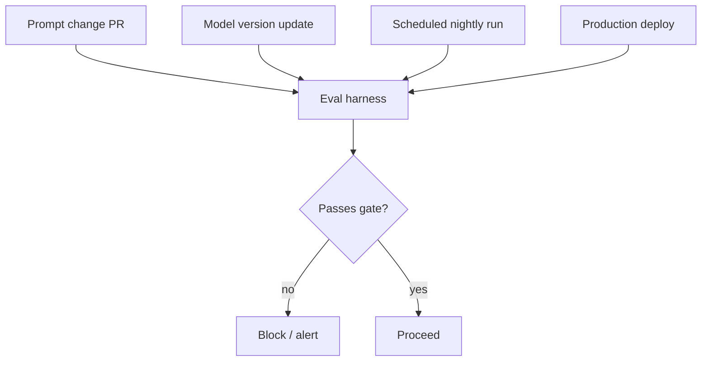

Everything this month has been building toward this: evaluation as continuous infrastructure, running automatically on every change, not something someone remembers to run manually before a big launch.

## The Trigger Points



Four distinct triggers, each catching a different class of problem: PR-triggered catches regressions before merge (June's CI post); scheduled runs catch drift even when nothing in your codebase changed (the drift-detection post); deploy-triggered catches infrastructure or config issues the code-level check might miss; model-version-triggered catches a provider-side change proactively rather than discovering it from a user complaint.

## A Scheduled Drift-Catching Run

```python
def nightly_eval_job():
    cases = load_golden_dataset("golden_set.jsonl")
    results = run_eval_suite(cases, current_production_system, scorers)
    report = aggregate_report(results, cases)

    yesterday_report = load_last_report()
    if report["overall_pass_rate"] < yesterday_report["overall_pass_rate"] - 0.03:
        alert_on_call(f"Nightly eval regression: {report['overall_pass_rate']:.2%} vs {yesterday_report['overall_pass_rate']:.2%}")

    save_report(report)
    log_to_dashboard(report)
```

This is the harness from two posts ago, scheduled via cron/GitHub Actions on a nightly cadence, with no code change required to trigger it — catching exactly the silent drift scenario from earlier this week, where quality degrades without anyone touching the codebase.

## Production Sampling as Continuous Evaluation

Beyond the fixed golden set, continuously run reference-free scorers (faithfulness, tone, task-success judging) against a sample of live production traffic, feeding directly into the dashboard from earlier this month:

```python
def continuous_production_eval(sample_rate: float = 0.05):
    for trace in stream_production_traces():
        if random.random() < sample_rate:
            scores = {name: scorer(trace) for name, scorer in reference_free_scorers.items()}
            log_to_dashboard(trace_id=trace.id, scores=scores)
```

## Closing the Loop: Failures Feed the Golden Set

```python
def process_continuous_eval_failure(trace: dict, scores: dict):
    if scores["quality_score"] < FAILURE_THRESHOLD:
        candidate = build_golden_example_from_trace(trace)
        queue_for_golden_set_review(candidate)  # human confirms before it's added permanently
```

This closes the full loop the whole month has been building toward: production catches a new failure mode → it becomes a golden example → it's protected by the CI gate forever after → continuous production sampling keeps catching whatever the golden set still doesn't cover. Each piece feeds the next.

## The Organizational Habit This Requires

None of this infrastructure matters if failures it surfaces don't get triaged and acted on. Continuous evaluation needs an owner and a response process — the same way a paging on-call rotation needs someone actually on call — or it becomes noise nobody looks at, which is worse than not having it at all, since it creates false confidence that quality is being watched.

---

*Part of the [Evaluation series]({{ site.baseurl }}/tags/evaluation-series/) — next: [postmortems for LLM incidents]({{ site.baseurl }}/posts/postmortems-llm-incidents-template/), for when continuous evaluation catches something serious.*
