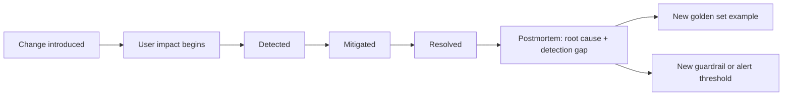

Every piece of infrastructure this month — golden sets, drift detection, canary rollback, continuous evaluation — will still occasionally miss something, and a real incident will happen. How you run the postmortem determines whether the incident makes the whole system meaningfully better or just gets quietly forgotten.



The timeline itself surfaces the detection gap — how long between impact starting and it actually being caught — and every postmortem should close with at least one concrete addition back into the golden set or alerting thresholds, not just a written record.

## What Makes an LLM Incident Postmortem Different

Traditional software postmortems trace a bug to a specific commit or config change. LLM incidents often don't have that — the "root cause" can be a gradual drift, an edge case the golden set never covered, or a provider-side model update nobody controlled. The template needs room for "we don't have a single root cause" as a legitimate, common finding.

## The Template

```markdown
## Incident Summary
- What happened, in one sentence a non-technical stakeholder would understand
- Duration and severity (how many users/requests affected)
- How it was detected — dashboard alert, user report, canary rollback, continuous eval

## Timeline
- When the underlying change (prompt, model, code, or external) was introduced
- When it started affecting users (may be before detection)
- When it was detected
- When it was mitigated
- When it was fully resolved

## Root Cause Analysis
- The proximate cause (what specifically changed)
- The contributing factors (why existing safeguards didn't catch it first)
- Was this covered by the golden set? If not, why not?

## Impact
- Quantified: requests affected, cost impact, user-visible symptoms
- Qualitative: what did affected users actually experience

## What Went Well
- Which safeguard, if any, limited the damage (a guardrail, a canary, a circuit breaker)

## Action Items
- Specific, owned, dated — not "improve monitoring" but "add category X to golden set by <date>, owner: <name>"
```

## Detection Gap Analysis Deserves Its Own Section

```python
def detection_gap_report(incident: dict) -> dict:
    return {
        "time_to_user_impact": incident["detected_at"] - incident["introduced_at"],
        "time_to_mitigation": incident["mitigated_at"] - incident["detected_at"],
        "which_safeguard_should_have_caught_this": identify_gap(incident),
        "why_it_didnt": incident.get("safeguard_failure_reason"),
    }
```

This is the section that turns a postmortem from a historical record into a system improvement — if the golden set should have caught this and didn't, that's a specific, fixable coverage gap; if the canary rollout guardrail threshold was too loose, that's a specific, fixable configuration issue.

## Blameless, But Specific

The standard "blameless postmortem" principle from traditional SRE practice applies directly — focus on system and process gaps, not individual fault. For LLM incidents specifically, this matters even more, since a meaningful fraction of incidents trace back to a provider-side change or an inherently unpredictable model behavior nobody could have reasonably prevented — the useful question is always "what would have caught this sooner," not "who's at fault."

## Feeding Postmortems Back Into the Evaluation Practice

Every postmortem should produce at least one new golden set example (from the incident's specific failure case) and, where relevant, a new guardrail or dashboard alert threshold — postmortems that don't concretely strengthen the evaluation and observability infrastructure from this month are a missed opportunity, not just paperwork.

---

*Part of the [Evaluation series]({{ site.baseurl }}/tags/evaluation-series/) — closing tomorrow with [a complete observability stack]({{ site.baseurl }}/posts/complete-observability-stack-llm/) that ties every piece from this month together.*
