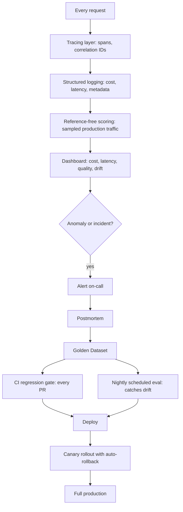

This closes out June by assembling every piece from the month into one reference architecture — what a production-grade LLM observability and evaluation stack actually looks like end to end.

## The Full Stack



## Layer by Layer

1. **Tracing** (mid-June posts) — every request instrumented with nested spans, correlation IDs, redacted sensitive data, sampled appropriately for volume
2. **Structured logging** — cost and latency captured per request, tagged by feature and user for attribution
3. **Golden dataset** (early June) — the stable regression set plus a rotating exploration set, continuously fed by production incidents and postmortems
4. **CI regression gate** — every prompt/code change run against the golden set before merge, with judge-based and reference-based scoring
5. **Scheduled continuous evaluation** — nightly runs catching drift that no code change triggered
6. **Production sampling** — reference-free scoring running continuously on live traffic
7. **Dashboards and alerting** — the four key numbers front and center, with anomaly-based alerting rather than dashboard-watching as primary detection
8. **Canary rollout with automatic rollback** — every change ships through staged exposure with guardrail-triggered auto-revert
9. **Incident response and postmortems** — closing the loop, feeding every real failure back into the golden dataset

## Minimal Viable Version for a Small Team

You don't need every layer from day one. A pragmatic starting point:

```python
minimal_stack = {
    "week_1": "structured logging + a 30-example golden set + manual eval script",
    "month_1": "CI regression gate + basic dashboard",
    "month_3": "production sampling + drift canary set + alerting",
    "month_6": "canary rollout automation + full postmortem process",
}
```

Building this incrementally, prioritized roughly in the order this month's posts covered them, is far more realistic than attempting the full stack at once — and each layer delivers value independently before the next one is added.

## The Principle Underlying All of It

Every technique this month traces back to one idea: LLM output quality is not stable by default, and treating "it worked in testing" as sufficient evidence for "it will keep working in production" is the single most common mistake in shipping AI products. Continuous, layered evaluation — not a one-time launch checklist — is what closes that gap.

## What's Next

July shifts from text-only evaluation to multimodal systems — vision, speech, and video — where every evaluation principle from this month still applies, with new modality-specific complications the rest of the roadmap will cover in depth.

---

*Part of the [Evaluation series]({{ site.baseurl }}/tags/evaluation-series/) — the final post in this series, leading into the [Multimodal AI series]({{ site.baseurl }}/tags/multimodal-series/) starting tomorrow.*
