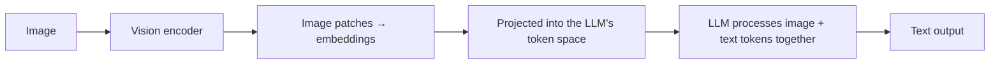

Everything so far in this roadmap has assumed text in, text out. Vision-language models (VLMs) break that assumption — the same model reasoning over your prompts can now reason over an image, a chart, a screenshot, or a scanned document in the same request.

## How a VLM Actually Processes an Image



An image is split into patches, each patch encoded into a vector by a vision encoder (commonly a variant of a Vision Transformer), then projected into the same embedding space the language model's text tokens live in. From the LLM's perspective, an image essentially becomes a sequence of extra "tokens" it reasons over exactly like text tokens — which is why the same reasoning techniques from the prompt engineering series (chain-of-thought, few-shot examples) transfer directly to multimodal prompts.

## A Minimal Vision API Call

```python
response = client.messages.create(
    model="claude-sonnet-5",
    messages=[{
        "role": "user",
        "content": [
            {"type": "image", "source": {"type": "base64", "media_type": "image/png", "data": image_b64}},
            {"type": "text", "text": "What's the trend in this chart?"},
        ],
    }],
)
```

Structurally, this is the same Messages API from the LLM engineering series — the content array just now mixes image and text blocks instead of being plain text.

## What VLMs Are Genuinely Good and Bad At

**Strong**: general scene description, reading clear printed text (OCR-adjacent tasks), understanding charts and diagrams at a high level, following visual instructions ("click the blue button").

**Weaker, worth testing explicitly before relying on**: precise spatial reasoning (exact pixel coordinates, precise counting of many similar objects), reading dense or low-quality handwriting, fine-grained numerical extraction from cluttered tables — several of these get dedicated posts and workaround techniques later this month.

## Resolution and Tiling

Most VLMs downsample large images internally, which can lose fine detail needed for tasks like reading small text in a screenshot. Providers commonly support tiling — splitting a large image into overlapping sections processed at full resolution — worth using explicitly for detail-critical tasks rather than trusting default downsampling:

```python
def prepare_high_detail_image(image_path: str, tile_size: int = 768) -> list[str]:
    tiles = split_into_tiles(image_path, tile_size, overlap=64)
    return [encode_base64(tile) for tile in tiles]
```

## Cost Implications

Image tokens count against context and cost the same way text tokens do, and a single high-resolution image can consume as many tokens as several paragraphs of text — factor this into cost estimates for any image-heavy feature, a concern the cost-and-latency post later this month covers in depth.

## Where This Series Goes

The rest of July builds outward from this foundation: OCR and document extraction, multimodal RAG, image generation, voice pipelines, video understanding, and closes with a complete multimodal agent that sees, hears, and acts.

---

*Part of the [Multimodal AI series]({{ site.baseurl }}/tags/multimodal-series/) — following June's [Evaluation series]({{ site.baseurl }}/tags/evaluation-series/).*
