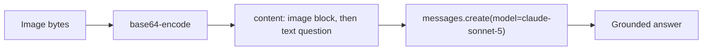

Same task as yesterday's GPT-4o walkthrough, on Claude's Vision API — worth doing as its own post because the practical differences (image ordering sensitivity, size limits, prompting style) are exactly the kind of detail that costs real debugging time if you assume the two APIs behave identically.



The content order matters here in a way it doesn't for OpenAI's API — placing the image block before the text question is Anthropic's documented best practice and measurably affects response quality, one of several concrete behavioral differences covered below.

## The Basic Call

```python
import anthropic
import base64

client = anthropic.Anthropic()

def ask_about_image(image_bytes: bytes, media_type: str, question: str) -> str:
    image_b64 = base64.b64encode(image_bytes).decode()
    response = client.messages.create(
        model="claude-sonnet-5",
        max_tokens=1024,
        messages=[{
            "role": "user",
            "content": [
                {"type": "image", "source": {"type": "base64", "media_type": media_type, "data": image_b64}},
                {"type": "text", "text": question},
            ],
        }],
    )
    return response.content[0].text
```

Note the content order — image block before the text question. Anthropic's documented best practice is to place images before the text that references them, which measurably affects response quality; OpenAI's API is less sensitive to this ordering, one of the concrete behavioral differences worth knowing rather than discovering through trial and error.

## Multi-Image Requests with Explicit Labeling

```python
def compare_images(images: list[tuple[bytes, str]], question: str) -> str:
    content = []
    for i, (img_bytes, media_type) in enumerate(images):
        content.append({"type": "text", "text": f"Image {i + 1}:"})
        content.append({"type": "image", "source": {"type": "base64", "media_type": media_type, "data": base64.b64encode(img_bytes).decode()}})
    content.append({"type": "text", "text": question})

    response = client.messages.create(model="claude-sonnet-5", max_tokens=1024, messages=[{"role": "user", "content": content}])
    return response.content[0].text
```

Explicitly labeling "Image 1:", "Image 2:" before each image is worth doing for any multi-image comparison task — it gives the model an unambiguous way to refer back to a specific image in its reasoning and final answer, rather than needing to infer ordinal position implicitly.

## Size and Format Constraints

Claude's API has documented maximum image dimensions and file size limits, and images exceeding them get automatically resized server-side — for detail-critical tasks, resize and check dimensions client-side yourself rather than relying on automatic resizing, so you control exactly what detail survives:

```python
from PIL import Image
import io

def resize_if_needed(image_bytes: bytes, max_dimension: int = 1568) -> bytes:
    img = Image.open(io.BytesIO(image_bytes))
    if max(img.size) > max_dimension:
        img.thumbnail((max_dimension, max_dimension), Image.LANCZOS)
        buf = io.BytesIO()
        img.save(buf, format="PNG")
        return buf.getvalue()
    return image_bytes
```

## PDF Support Directly

Claude's API also accepts PDF documents directly as a content block, handling both visual layout and text extraction internally — relevant for the document-processing posts later this month, and often simpler than converting a PDF to images yourself first.

```python
{"type": "document", "source": {"type": "base64", "media_type": "application/pdf", "data": pdf_b64}}
```

## Choosing Between Providers for a Vision Feature

Run the same task-specific evaluation approach from June's cost-quality comparison post specifically for your vision use case — general vision benchmarks don't reliably predict performance on your specific document layouts or image types, and the two providers' relative strengths shift with model updates often enough that a direct comparison beats trusting either provider's marketing claims.

---

*Part of the [Multimodal AI series]({{ site.baseurl }}/tags/multimodal-series/) — next: [OCR and document understanding]({{ site.baseurl }}/posts/ocr-document-understanding-vision-models/), building directly on Claude's native PDF support.*
