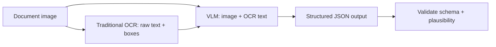

Traditional OCR engines (Tesseract, cloud OCR APIs) extract raw text but have no understanding of document structure or meaning. Vision-language models do both at once — reading text and reasoning about what it means, which changes how you should approach document extraction tasks entirely.



The hybrid pattern feeds both the raw image and the OCR text into the VLM together, giving the model a text fallback for anything the vision pass alone might misread, while the model still reasons over layout — what's a header, what's a table row — that flat OCR text discards entirely.

## Traditional OCR vs VLM-Based Extraction

```python
# Traditional OCR — text only, no structure
raw_text = tesseract.image_to_string(document_image)
# "Invoice #4471 Total: $1,240.00 Due: 2026-08-15 ..." — a flat string, structure lost

# VLM-based extraction — structured, with reasoning
response = client.messages.create(
    model="claude-sonnet-5", max_tokens=1024,
    messages=[{"role": "user", "content": [
        {"type": "image", "source": {"type": "base64", "media_type": "image/png", "data": img_b64}},
        {"type": "text", "text": "Extract invoice number, total, and due date as JSON."},
    ]}],
)
```

The VLM approach skips the intermediate flat-text representation entirely — it reasons directly from the visual layout to structured output, which matters because layout (what's near what, what's in a table versus a header) carries meaning traditional OCR discards.

## When Traditional OCR Is Still the Right Tool

VLM extraction isn't strictly better in every case — traditional OCR remains faster and cheaper for high-volume, simple text extraction where structure doesn't matter, and it's more predictable for extremely dense text pages where a VLM's token budget for the image becomes a real cost concern. Use traditional OCR as a first pass and VLM extraction specifically where structure and reasoning add value.

## Combining Both: OCR for Text, VLM for Structure

A common effective pattern uses OCR to extract raw text with bounding box coordinates, then feeds both the image and the OCR text to a VLM for structuring — giving the model a text fallback for anything the vision pass alone might misread:

```python
def hybrid_extraction(image_bytes: bytes) -> dict:
    ocr_text = run_ocr_with_boxes(image_bytes)
    response = client.messages.create(
        model="claude-sonnet-5", max_tokens=1024,
        messages=[{"role": "user", "content": [
            {"type": "image", "source": {"type": "base64", "media_type": "image/png", "data": base64.b64encode(image_bytes).decode()}},
            {"type": "text", "text": f"OCR text (may contain errors): {ocr_text}\n\nUsing both the image and this OCR text, extract structured invoice data as JSON."},
        ]}],
    )
    return json.loads(response.content[0].text)
```

## Handling Multi-Page Documents

```python
def extract_multipage_document(page_images: list[bytes], schema: dict) -> dict:
    content = [{"type": "text", "text": f"This document has {len(page_images)} pages. Extract data matching this schema: {json.dumps(schema)}"}]
    for i, page in enumerate(page_images):
        content.append({"type": "text", "text": f"Page {i + 1}:"})
        content.append({"type": "image", "source": {"type": "base64", "media_type": "image/png", "data": base64.b64encode(page).decode()}})
    response = client.messages.create(model="claude-sonnet-5", max_tokens=4096, messages=[{"role": "user", "content": content}])
    return json.loads(response.content[0].text)
```

Labeling pages explicitly matters even more here than in the multi-image comparison case — a multi-page document extraction needs the model to track which fact came from which page, particularly for documents where a value on page 3 references or corrects something stated on page 1.

## Validating Extraction Quality

Apply the structured-output validation patterns from the LLM engineering series (Pydantic schema validation) directly to extraction output, plus a specific check worth adding for document extraction: confirm extracted numeric and date fields are plausible (a due date shouldn't be in 1970, a total shouldn't be negative) before trusting output downstream.

---

*Part of the [Multimodal AI series]({{ site.baseurl }}/tags/multimodal-series/) — next: applying this directly to [extracting structured data from invoices and receipts]({{ site.baseurl }}/posts/extracting-structured-data-invoices-receipts/).*
