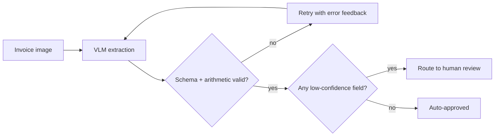

Invoice and receipt extraction is one of the most common production multimodal use cases — and one where getting the schema and validation right matters more than the extraction prompt itself, since these documents feed directly into financial systems where an extraction error has real cost.



The diagram lays out the full pipeline from this post: extraction isn't a single call, it's a validate-and-retry loop feeding a confidence-based routing decision. Both gates — schema/arithmetic validation and per-field confidence — matter independently, since a numerically self-consistent extraction can still contain a confidently wrong digit.

## Defining a Strict Schema

```python
from pydantic import BaseModel, Field, field_validator
from datetime import date

class LineItem(BaseModel):
    description: str
    quantity: float
    unit_price: float
    total: float

class Invoice(BaseModel):
    invoice_number: str
    vendor_name: str
    invoice_date: date
    due_date: date | None
    line_items: list[LineItem]
    subtotal: float
    tax: float
    total: float

    @field_validator("total")
    @classmethod
    def total_matches_line_items(cls, v, info):
        items = info.data.get("line_items", [])
        expected = sum(item.total for item in items) + info.data.get("tax", 0)
        if abs(v - expected) > 0.01:
            raise ValueError(f"Total {v} doesn't match line items + tax ({expected})")
        return v
```

The `total_matches_line_items` validator is worth calling out specifically — it's a domain-knowledge check no generic JSON schema validation would catch, and it's exactly the kind of arithmetic consistency a VLM can get subtly wrong (misreading one digit in a line item) even when every individual field looks plausible in isolation.

## Extraction with Retry on Validation Failure

```python
def extract_invoice(image_bytes: bytes, max_retries: int = 2) -> Invoice:
    schema_json = Invoice.model_json_schema()
    for attempt in range(max_retries + 1):
        response = client.messages.create(
            model="claude-sonnet-5", max_tokens=2048,
            messages=[{"role": "user", "content": [
                {"type": "image", "source": {"type": "base64", "media_type": "image/png", "data": base64.b64encode(image_bytes).decode()}},
                {"type": "text", "text": f"Extract this invoice matching schema: {schema_json}. Return only JSON."},
            ]}],
        )
        try:
            return Invoice.model_validate_json(response.content[0].text)
        except ValidationError as e:
            if attempt == max_retries:
                raise
            # feed the validation error back for the retry
    raise ExtractionFailed()
```

This is the structured-output-with-validation pattern from the LLM engineering series, applied to document extraction specifically — the arithmetic validator above is what catches errors a purely schema-shaped check would let through silently.

## Confidence Scoring for Human Review Routing

Not every extraction needs human review, but low-confidence ones do — ask the model to flag its own uncertainty per field, and route accordingly:

```python
def extract_with_confidence(image_bytes: bytes) -> dict:
    response = client.messages.create(
        model="claude-sonnet-5", max_tokens=2048,
        messages=[{"role": "user", "content": [
            {"type": "image", "source": {"type": "base64", "media_type": "image/png", "data": base64.b64encode(image_bytes).decode()}},
            {"type": "text", "text": "Extract invoice fields. For each field, also note confidence (high/medium/low) — low confidence for anything blurry, ambiguous, or handwritten."},
        ]}],
    )
    result = json.loads(response.content[0].text)
    needs_review = any(f["confidence"] == "low" for f in result["fields"].values())
    return {"data": result, "needs_human_review": needs_review}
```

## Handling Format Variation Across Vendors

Real invoices from different vendors vary wildly in layout — resist the temptation to hardcode layout-specific parsing logic (the traditional OCR-plus-regex approach) and instead lean on the VLM's ability to generalize across layouts, validating the *output schema* strictly rather than the input format.

## Building a Golden Set Specific to This Task

Following June's evaluation series directly: build a golden set of real invoices (anonymized) spanning your actual vendor diversity, with hand-verified correct extractions, and run the CI regression gate against it before any prompt or model change ships to this pipeline — extraction accuracy regressions here have direct financial consequences, making this one of the highest-stakes places to apply that discipline.

---

*Part of the [Multimodal AI series]({{ site.baseurl }}/tags/multimodal-series/) — next: [table extraction from scanned documents]({{ site.baseurl }}/posts/table-extraction-scanned-documents/), the specific sub-problem of structured tabular data.*
