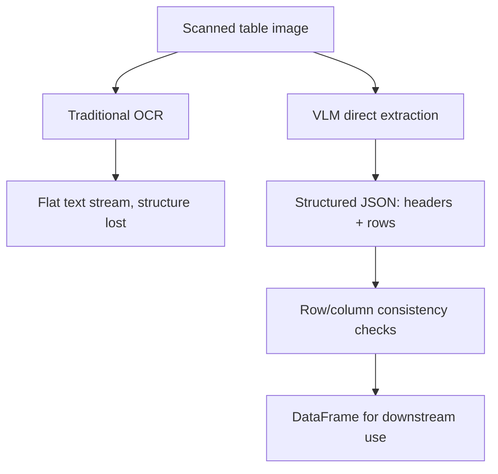

Tables are the specific document element that breaks most extraction pipelines — cell boundaries are visual, not textual, and a naive OCR pass turns a two-dimensional grid into a jumbled flat text stream that loses which value belonged to which row and column.



The diagram contrasts the two paths this post walks through: flattening a table into text loses the grid structure that gives each value meaning, while extracting directly into structured JSON from the image preserves it — which is why the validation and DataFrame-conversion sections that follow build on the VLM path, not the OCR one.

## Why Tables Are Uniquely Hard

```
Raw OCR output from a table, structure lost:
"Product Qty Price Widget A 12 4.50 Widget B 3 12.00 Total 88.50"
```

A human reading that raw text can probably reconstruct the table with effort. A downstream parser can't reliably — is "12" a quantity or a price? VLM-based extraction, working from the actual visual grid layout, doesn't have this ambiguity because it reasons over the image directly, not a flattened text stream.

## Extracting a Table as Structured JSON

```python
def extract_table(image_bytes: bytes) -> dict:
    response = client.messages.create(
        model="claude-sonnet-5", max_tokens=2048,
        messages=[{"role": "user", "content": [
            {"type": "image", "source": {"type": "base64", "media_type": "image/png", "data": base64.b64encode(image_bytes).decode()}},
            {"type": "text", "text": "Extract the table as JSON: {\"headers\": [...], \"rows\": [[...], ...]}. "
                                     "Preserve exact column order. Empty cells should be null, not omitted."},
        ]}],
    )
    return json.loads(response.content[0].text)
```

The instruction to keep empty cells as `null` rather than omitted matters — an omitted cell silently shifts every subsequent value in that row when the JSON is parsed back into a fixed-width structure, a subtle bug that's easy to miss until numbers stop lining up downstream.

## Handling Merged Cells and Multi-Row Headers

Real-world tables often have merged header cells spanning multiple columns, or multi-level headers. Be explicit in the prompt about how to represent these, since there's no single obvious JSON representation the model will default to consistently:

```python
prompt_addendum = """For merged header cells spanning multiple columns, repeat the merged
label for each column it spans. For multi-row headers, concatenate levels with ' > ',
e.g. 'Q1 > Revenue'."""
```

## Validating Extracted Tables

```python
def validate_table_extraction(table: dict) -> list[str]:
    issues = []
    expected_cols = len(table["headers"])
    for i, row in enumerate(table["rows"]):
        if len(row) != expected_cols:
            issues.append(f"Row {i} has {len(row)} cells, expected {expected_cols}")
    numeric_cols = detect_numeric_columns(table)
    for col_idx in numeric_cols:
        if any(not is_numeric_or_null(row[col_idx]) for row in table["rows"]):
            issues.append(f"Column {col_idx} expected numeric, found non-numeric value")
    return issues
```

Row-length consistency and per-column type consistency are cheap, high-signal checks that catch a meaningful fraction of extraction errors before the data reaches anything downstream — worth running automatically on every extraction, not just spot-checked manually.

## Converting to a DataFrame for Downstream Use

```python
import pandas as pd

def table_to_dataframe(table: dict) -> pd.DataFrame:
    df = pd.DataFrame(table["rows"], columns=table["headers"])
    return df.apply(pd.to_numeric, errors="ignore")
```

## Tables Spanning Multiple Pages

For a table that continues across a page break, extract each page's table fragment separately, then merge based on matching header structure — asking a single request to correctly extract and stitch a multi-page table end-to-end is usually less reliable than extracting page-by-page and stitching programmatically once headers are confirmed to match.

---

*Part of the [Multimodal AI series]({{ site.baseurl }}/tags/multimodal-series/) — next: [multimodal RAG]({{ site.baseurl }}/posts/multimodal-rag-text-tables-images/), retrieving across text, tables, and images together.*
