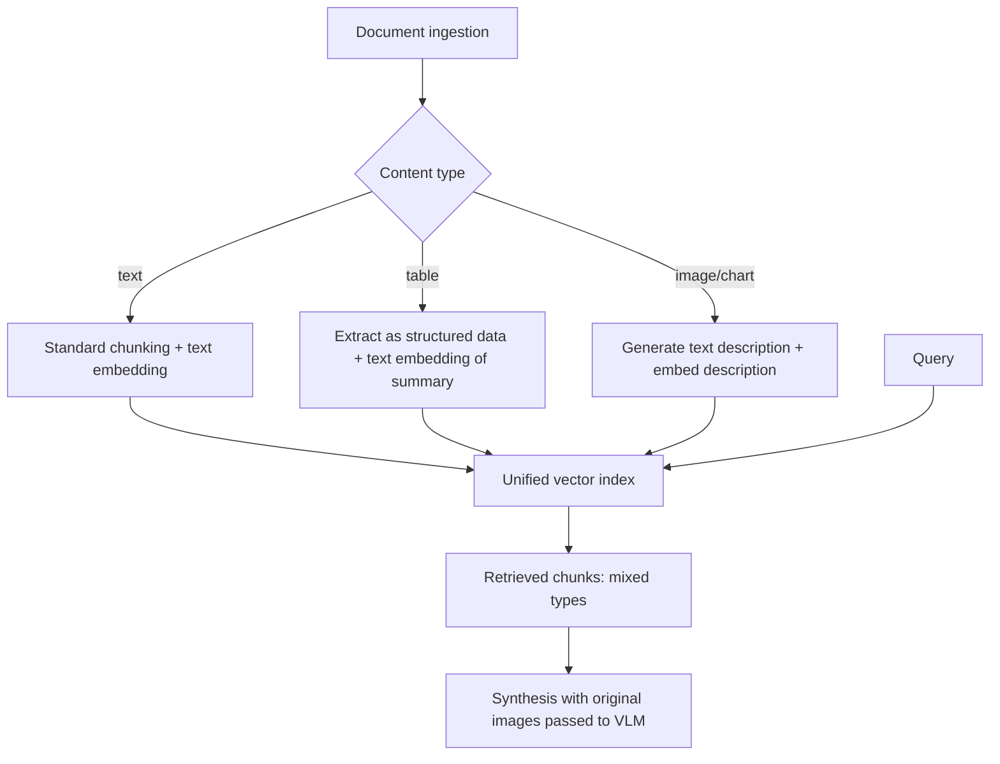

March's RAG series assumed a purely text knowledge base. Real document collections mix text, tables, charts, and diagrams — and a naive text-only chunking pipeline either drops that visual content entirely or mangles it into unusable flattened text.

## The Architecture



## Two Strategies for Making Images Retrievable

**Text-description embedding**: generate a text description of each image at ingestion time, embed the description alongside your text chunks using a standard text embedding model. Simple, works with existing text-only vector infrastructure from March's series.

```python
def index_image(image_bytes: bytes, doc_id: str, page: int):
    description = generate_image_description(image_bytes)  # VLM call at ingestion time
    embedding = embed(description)
    vector_store.upsert(id=f"{doc_id}-p{page}-img", vector=embedding,
                         payload={"type": "image", "description": description, "image_ref": store_image(image_bytes)})
```

**Multimodal embeddings**: use a model like CLIP (covered in depth later this month) that embeds images and text into the *same* vector space directly, allowing text queries to retrieve relevant images without an intermediate description step — more setup complexity, but avoids losing whatever detail a text description couldn't fully capture.

## Retrieval Across Mixed Content Types

```python
def multimodal_search(query: str, top_k: int = 5) -> list[dict]:
    query_embedding = embed(query)
    results = vector_store.search(query_embedding, top_k=top_k)
    return [{"type": r.payload["type"], "content": r.payload.get("text") or r.payload.get("description"),
             "image_ref": r.payload.get("image_ref")} for r in results]
```

## Synthesis: Passing Original Images Back to the Generator

The key design decision that makes multimodal RAG work well: at generation time, pass the *original images* for any retrieved image chunks back into the VLM, not just their text descriptions — the description was only ever a retrieval aid, and the final answer should reason over the actual visual content:

```python
def synthesize_multimodal_answer(query: str, retrieved: list[dict]) -> str:
    content = [{"type": "text", "text": f"Question: {query}\n\nContext:"}]
    for item in retrieved:
        if item["type"] == "image":
            content.append({"type": "image", "source": {"type": "base64", "media_type": "image/png",
                                                          "data": base64.b64encode(load_image(item["image_ref"])).decode()}})
        else:
            content.append({"type": "text", "text": item["content"]})
    content.append({"type": "text", "text": "Answer using the above context, citing sources."})
    response = client.messages.create(model="claude-sonnet-5", max_tokens=1024, messages=[{"role": "user", "content": content}])
    return response.content[0].text
```

## Chunking Strategy for Tables Specifically

Tables need their own chunking treatment — never split a table mid-row across chunk boundaries the way you might split flowing text. Extract each table (using yesterday's technique) as a single atomic chunk, with a generated text summary embedded for retrieval, and the full structured table data attached as payload for the generation step.

## Evaluating Multimodal RAG

Apply March's RAGAS-style faithfulness and relevancy metrics, extended to check that image-grounded claims in the answer actually match what's visible in the retrieved image — this needs a VLM-based faithfulness judge rather than the text-only version, since the source of truth for some claims is now visual, not textual.

---

*Part of the [Multimodal AI series]({{ site.baseurl }}/tags/multimodal-series/) — next: [chart and graph understanding]({{ site.baseurl }}/posts/chart-graph-understanding-vision-models/) specifically, a common and tricky multimodal RAG content type.*
