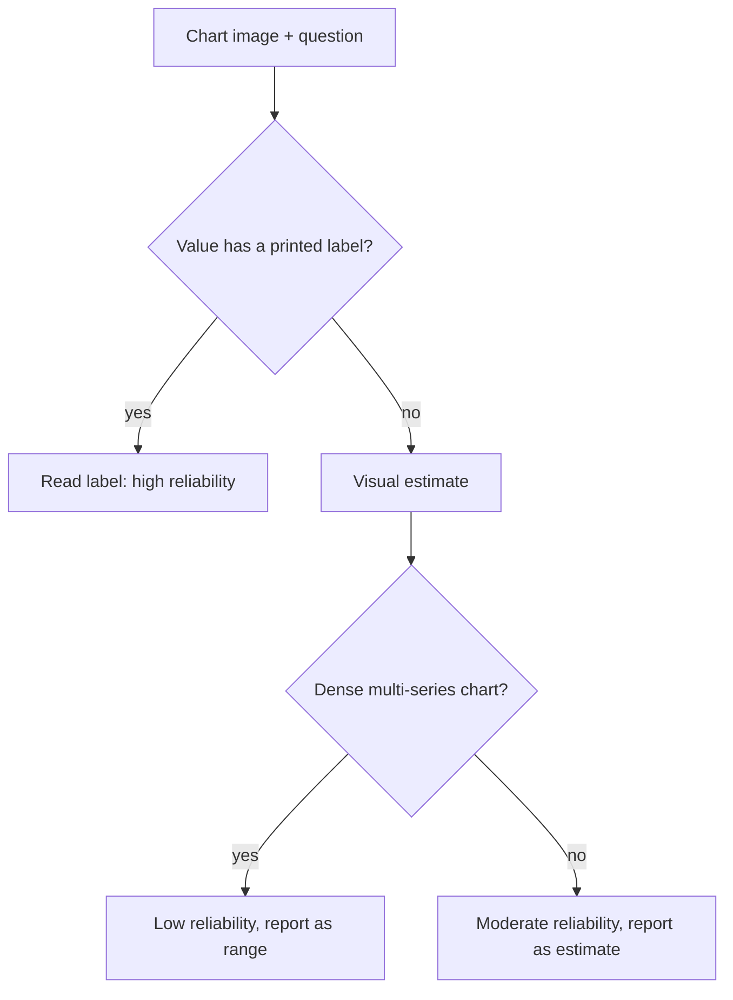

Charts pack numeric information into a visual encoding — bar height, line slope, pie slice angle — that VLMs read with real but bounded reliability. Understanding exactly where that reliability breaks down is what determines whether you can trust chart-derived answers in a production system.



This is the reliability split the whole post is organized around — labeled data points behave like OCR, while unlabeled estimation degrades further as chart density increases. Treating every extracted number with this same confidence tag is what the prompting pattern below is designed to enforce.

## What VLMs Read Reliably

- **Overall trend** — "revenue is increasing," "this metric has a seasonal pattern" — high reliability
- **Relative comparison** — "bar A is taller than bar B" — generally reliable for visually distinct differences
- **Labeled data points** — reading an explicit data label printed on the chart itself — high reliability, since this is closer to OCR than visual estimation

## What VLMs Read Unreliably

- **Precise value estimation without labels** — reading an unlabeled bar's exact height against an axis and inferring "approximately 47.3" is genuinely unreliable; treat any such extracted number as an estimate, not a fact
- **Dense multi-series charts** — many overlapping lines or a crowded stacked bar chart increases misattribution risk (assigning a value to the wrong series)
- **Precise pixel-level measurements** — anything requiring the model to measure rather than read

## A Prompting Pattern That Improves Reliability

```python
def analyze_chart(image_bytes: bytes, question: str) -> dict:
    response = client.messages.create(
        model="claude-sonnet-5", max_tokens=1024,
        messages=[{"role": "user", "content": [
            {"type": "image", "source": {"type": "base64", "media_type": "image/png", "data": base64.b64encode(image_bytes).decode()}},
            {"type": "text", "text": f"""First, describe what type of chart this is and what's labeled on each axis.
Then answer: {question}
For any specific numeric value you state, note whether it's an exact printed label
or your visual estimate, and if estimated, give a range rather than a single number."""},
        ]}],
    )
    return response.content[0].text
```

Forcing the model to distinguish "exact label" from "visual estimate" explicitly in its own output is a cheap, effective way to surface the reliability gap to whoever reads the answer — rather than presenting an estimated number with the same false confidence as an exact one.

## Extracting the Underlying Data, Not Just Answering Questions

For cases where you need the chart's actual data (to recreate it, or feed it into further analysis), extract structured data points explicitly, flagging confidence per point:

```python
def extract_chart_data(image_bytes: bytes) -> dict:
    response = client.messages.create(
        model="claude-sonnet-5", max_tokens=1024,
        messages=[{"role": "user", "content": [
            {"type": "image", "source": {"type": "base64", "media_type": "image/png", "data": base64.b64encode(image_bytes).decode()}},
            {"type": "text", "text": "Extract data points as JSON: {series_name, x_value, y_value, confidence: 'exact'|'estimated'}."},
        ]}],
    )
    return json.loads(response.content[0].text)
```

## When to Insist on the Source Data Instead

If a chart is generated from data you actually have access to elsewhere in your pipeline (a chart your own system rendered, for instance), always prefer querying the underlying data directly over re-extracting it visually from the rendered image — visual extraction is a fallback for cases where the source data genuinely isn't available, not a default approach when it is.

## Evaluation for Chart Understanding Specifically

Build a golden set of charts with known-correct data points and trend descriptions, explicitly including a mix of clearly-labeled and unlabeled-estimate cases — measuring accuracy separately for each category, since conflating them hides exactly the reliability gap this post is about.

---

*Part of the [Multimodal AI series]({{ site.baseurl }}/tags/multimodal-series/) — next, switching from understanding images to creating them: [image generation APIs compared]({{ site.baseurl }}/posts/image-generation-apis-compared/).*
