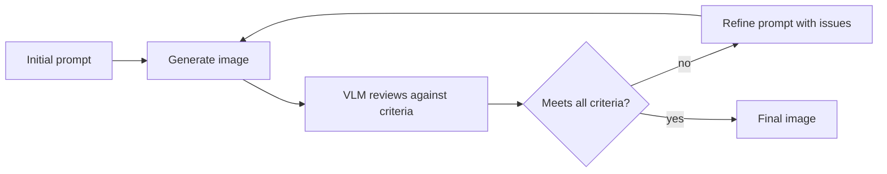

Prompt engineering for image generation is a genuinely different discipline from the text-prompting techniques covered earlier in this roadmap — the same "be specific and structured" principle applies, but expressed through different mechanics.



This generate-critique-refine loop is the highest-leverage technique in this post — rather than hand-tuning a single prompt, a VLM reviews each generation against explicit criteria and feeds specific issues back into the next attempt, closing the loop without a human in it for every round.

## Structure: Subject, Style, Composition, Detail

A reliable image prompt structure, roughly in priority order the model tends to weight:

```python
def build_image_prompt(subject: str, style: str, composition: str, details: list[str]) -> str:
    return f"{subject}, {style}, {composition}, {', '.join(details)}"

prompt = build_image_prompt(
    subject="a minimalist icon of a database server",
    style="flat vector illustration, two-color palette",
    composition="centered, plenty of negative space",
    details=["rounded corners", "no text", "1:1 aspect ratio"],
)
```

Front-loading the subject and putting stylistic and compositional modifiers after tends to produce more consistent adherence than burying the core subject in the middle of a long descriptive paragraph.

## Negative Prompting

Some providers support explicit negative prompts — describing what to *avoid* rather than only what to include:

```python
response = generate_image(
    prompt="a clean product photo of a coffee mug on a white background",
    negative_prompt="blurry, watermark, text, extra objects, cluttered background",
)
```

For providers without a dedicated negative-prompt parameter, folding exclusions directly into the main prompt ("...on a plain white background with no other objects, no text, no watermark") achieves a similar, if slightly less reliable, effect.

## Iterative Refinement Loops

Rather than trying to get a perfect prompt on the first attempt, build a generate-critique-refine loop, applying the same self-review pattern from April's coding-agent post to image generation:

```python
def generate_with_refinement(initial_prompt: str, target_criteria: list[str], max_rounds: int = 3) -> bytes:
    prompt = initial_prompt
    for _ in range(max_rounds):
        image = generate_image(prompt)
        review = vlm_review_image(image, target_criteria)
        if review["meets_all_criteria"]:
            return image
        prompt = refine_prompt(prompt, review["issues"])
    return image  # best effort after max_rounds

def vlm_review_image(image: bytes, criteria: list[str]) -> dict:
    response = client.messages.create(model="claude-sonnet-5", max_tokens=512, messages=[{
        "role": "user", "content": [
            {"type": "image", "source": {"type": "base64", "media_type": "image/png", "data": base64.b64encode(image).decode()}},
            {"type": "text", "text": f"Does this image meet these criteria: {criteria}? Return JSON with issues if not."},
        ],
    }])
    return json.loads(response.content[0].text)
```

Using a VLM to review the *generated* image against your criteria and feed specific issues back into prompt refinement is a practical, automatable way to close the loop without a human in it for every generation.

## Consistency Across Multiple Generations

For product features needing a consistent visual style across many generated images (a set of icons, a series of illustrations), lock down the style and composition portions of the prompt template exactly, varying only the subject — inconsistent phrasing of the "style" segment across calls is the most common cause of a visually inconsistent generated set.

## Seed Control for Reproducibility

Where the provider supports it, fixing a random seed lets you reproduce the same base composition while iterating on prompt wording — useful for isolating exactly what a prompt change affected, the same debugging discipline as changing one variable at a time in any experiment.

---

*Part of the [Multimodal AI series]({{ site.baseurl }}/tags/multimodal-series/) — next: [image editing and inpainting]({{ site.baseurl }}/posts/image-editing-inpainting-ai/), modifying existing images rather than generating from scratch.*
