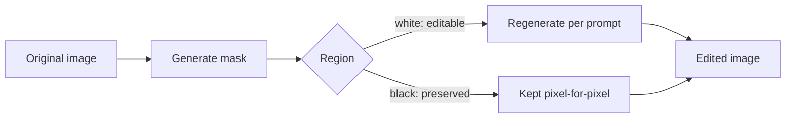

Generation from scratch is one use case; editing an existing image — removing an object, changing a background, extending a canvas — is a distinct capability with its own API shape and its own prompting considerations.



The mask is the mechanism underlying every technique in this post — inpainting, outpainting, and object removal are all the same masked-region regeneration, differing only in how the mask is produced and what prompt targets the editable area.

## Inpainting: Editing Within a Masked Region

```python
def inpaint_region(image_bytes: bytes, mask_bytes: bytes, prompt: str) -> bytes:
    response = openai_client.images.edit(
        image=image_bytes,
        mask=mask_bytes,  # white = editable region, black = preserved
        prompt=prompt,
        size="1024x1024",
    )
    return download_image(response.data[0].url)
```

The mask is what makes inpainting precise — everything outside the white region is preserved pixel-for-pixel, only the masked area is regenerated according to the prompt. Producing a good mask (from a user's freehand selection, or programmatically via object detection) is often the harder engineering problem relative to the generation call itself.

## Outpainting: Extending Beyond the Original Canvas

```python
def outpaint_canvas(image_bytes: bytes, new_width: int, new_height: int, prompt: str) -> bytes:
    canvas = create_larger_canvas(image_bytes, new_width, new_height)  # original centered, rest transparent
    mask = create_mask_from_transparency(canvas)
    return inpaint_region(canvas, mask, prompt)
```

Outpainting is inpainting with the mask covering everything *outside* the original image on a larger canvas — same underlying mechanism, different practical use (extending a photo's background, adapting an image to a different aspect ratio for a different placement).

## Object Removal as a Specific Pattern

```python
def remove_object(image_bytes: bytes, object_description: str) -> bytes:
    mask = generate_mask_for_object(image_bytes, object_description)  # via a segmentation model or VLM-guided selection
    return inpaint_region(image_bytes, mask, prompt="seamless background, matching surrounding texture and lighting")
```

A prompt describing the *desired result* of the fill ("seamless matching background"), not the object being removed, produces more reliable results than naming what should disappear — the model is filling in what should be there, not being asked to subtract.

## Generating Masks Programmatically with a VLM

```python
def generate_mask_for_object(image_bytes: bytes, object_description: str) -> bytes:
    response = client.messages.create(
        model="claude-sonnet-5", max_tokens=512,
        messages=[{"role": "user", "content": [
            {"type": "image", "source": {"type": "base64", "media_type": "image/png", "data": base64.b64encode(image_bytes).decode()}},
            {"type": "text", "text": f"Give bounding box coordinates (x1,y1,x2,y2) for: {object_description}"},
        ]}],
    )
    bbox = parse_bbox(response.content[0].text)
    return create_mask_from_bbox(image_bytes, bbox)
```

A VLM-derived bounding box is a coarse mask — fine for many editing use cases, but for precise pixel-accurate masking of complex shapes, a dedicated segmentation model still outperforms a VLM's spatial reasoning, echoing the earlier post's caution about precise spatial tasks.

## Iterative Editing Workflows

```python
def iterative_edit(image_bytes: bytes, edit_instructions: list[str]) -> bytes:
    current = image_bytes
    for instruction in edit_instructions:
        mask = generate_mask_for_object(current, instruction["target"])
        current = inpaint_region(current, mask, instruction["prompt"])
    return current
```

Chaining several targeted edits, each verified before the next, tends to produce more controllable results than attempting a complex multi-part edit in a single generation call — the same decomposition principle from the agent-planning posts, applied to visual editing.

## Quality Checks Before Shipping an Edited Image

Automated seam-detection (comparing pixel statistics at the mask boundary) and a VLM-based "does this look like a natural, unedited photo" check both catch a meaningful fraction of visibly poor edits before they reach a user — worth running as a gate for any user-facing editing feature.

---

*Part of the [Multimodal AI series]({{ site.baseurl }}/tags/multimodal-series/) — next, moving to audio: [comparing speech-to-text providers]({{ site.baseurl }}/posts/speech-to-text-whisper-deepgram-assemblyai/).*
