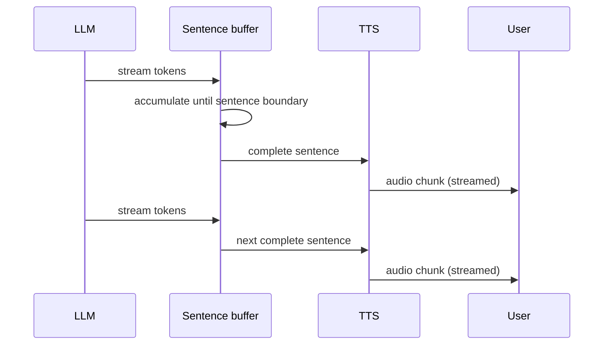

Modern TTS has moved well past the robotic, choppy voices of a few years ago — but "natural-sounding" in a demo and "natural-sounding across an entire production conversation" are different bars, and this post covers what closes that gap.



Chunking at sentence boundaries rather than a fixed token count is what keeps the lowest-latency pipeline (streaming LLM output directly into TTS) sounding natural — a TTS model given a full clause produces noticeably better prosody than one fed arbitrary text fragments.

## Basic Streaming TTS

```python
async def stream_tts(text: str):
    response = await openai_client.audio.speech.create(
        model="tts-1", voice="alloy", input=text, response_format="pcm",
    )
    async for chunk in response.iter_bytes(chunk_size=4096):
        yield chunk
```

`response_format="pcm"` gives raw audio suitable for immediate playback in a real-time pipeline, versus a compressed format better suited to storing a finished audio file — pick based on whether you're streaming live or generating a file to save.

## Streaming Token-by-Token from the LLM Directly Into TTS

The lowest-latency voice pipeline doesn't wait for a complete LLM response before starting TTS — it streams sentence fragments to TTS as they're generated:

```python
async def llm_to_speech_pipeline(prompt: str):
    buffer = ""
    async for token in llm.astream(prompt):
        buffer += token
        if ends_with_sentence_boundary(buffer):
            async for audio_chunk in stream_tts(buffer):
                yield audio_chunk
            buffer = ""
    if buffer:
        async for audio_chunk in stream_tts(buffer):
            yield audio_chunk
```

Chunking at sentence boundaries, not arbitrary token counts, matters for prosody — TTS models produce more natural intonation when given a complete clause or sentence rather than an arbitrary text fragment cut off mid-thought.

## Voice Selection and Consistency

For a product with a defined brand voice (echoing June's tone-consistency post, now for audio), lock in a specific voice ID and don't vary it across sessions — voice consistency is part of brand consistency the same way tone and phrasing are, and users notice an inconsistent voice more readily than inconsistent text style.

## SSML for Fine Control

Where supported, Speech Synthesis Markup Language gives explicit control over pacing, emphasis, and pauses that plain text input can't express:

```python
ssml_input = """
<speak>
  Your order <emphasis level="strong">has shipped</emphasis>.
  <break time="500ms"/>
  Expected delivery is <say-as interpret-as="date">2026-07-18</say-as>.
</speak>
"""
```

Worth using specifically for content where exact pacing matters — reading back a confirmation number slowly and clearly, or emphasizing a critical warning — rather than for general conversational responses where natural-sounding default prosody is usually good enough.

## Handling Numbers, Dates, and Abbreviations Correctly

TTS engines vary in how they handle "3/4/26" or "Dr." or "$1,240.50" — normalize this kind of content explicitly before sending to TTS rather than trusting default pronunciation, especially for domain-specific abbreviations a general TTS model wasn't tuned for:

```python
def normalize_for_speech(text: str) -> str:
    text = expand_abbreviations(text, domain_specific_map)
    text = spell_out_currency(text)
    return text
```

## Evaluating TTS Quality

Beyond subjective listening tests, track objective proxies: mean opinion score (MOS) from periodic human rating, latency to first audio chunk (critical for the perceived-responsiveness concern from April's voice post), and pronunciation error rate on a golden set of domain-specific terms your product uses regularly.

---

*Part of the [Multimodal AI series]({{ site.baseurl }}/tags/multimodal-series/) — next: assembling STT and TTS into [a real-time voice assistant pipeline]({{ site.baseurl }}/posts/real-time-voice-assistant-pipeline/) end to end.*
