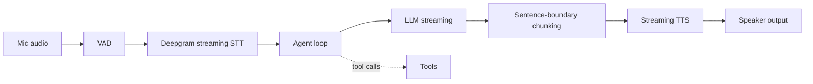

This assembles the last three posts — STT, TTS, and April's voice-agent architecture — into a complete, working real-time voice assistant, with every latency-critical decision made explicit.

## Full Architecture



## The Full Pipeline Implementation

```python
class VoiceAssistant:
    def __init__(self, tools: dict):
        self.tools = tools
        self.conversation_history = []

    async def handle_turn(self, audio_stream):
        transcript = ""
        async for partial in stream_transcribe(audio_stream):
            transcript = partial
        self.conversation_history.append({"role": "user", "content": transcript})

        buffer = ""
        async for token in self.stream_agent_response():
            buffer += token
            if ends_with_sentence_boundary(buffer):
                async for audio_chunk in stream_tts(buffer):
                    yield audio_chunk
                buffer = ""
        if buffer:
            async for audio_chunk in stream_tts(buffer):
                yield audio_chunk

    async def stream_agent_response(self):
        response_text = ""
        async for event in llm.astream(self.conversation_history, tools=list(self.tools.values())):
            if event.type == "tool_call":
                result = self.tools[event.tool_name](**event.arguments)
                self.conversation_history.append({"role": "tool", "content": str(result)})
            elif event.type == "token":
                response_text += event.content
                yield event.content
        self.conversation_history.append({"role": "assistant", "content": response_text})
```

## Handling Tool Calls Without Killing Responsiveness

A tool call mid-response creates a natural pause — no text to speak while the tool runs. Fill it with a brief spoken acknowledgment rather than silence, which measurably improves perceived responsiveness in real voice interfaces:

```python
async def handle_tool_call_with_feedback(tool_name: str, arguments: dict):
    filler = get_natural_filler(tool_name)  # "Let me check that..." "One moment..."
    async for chunk in stream_tts(filler):
        yield chunk
    result = await run_tool_async(tool_name, arguments)
    return result
```

## Interruption Handling, Wired In

```python
async def handle_turn_with_interruption(audio_stream, playback_controller):
    async for partial_transcript in stream_transcribe(audio_stream):
        if playback_controller.is_speaking and len(partial_transcript.strip()) > 3:
            await playback_controller.stop()  # user started talking — stop immediately
            break
```

## End-to-End Latency Budget

```python
latency_budget = {
    "vad_to_stt_start": 50,       # ms
    "stt_final_transcript": 300,
    "first_llm_token": 400,
    "first_audio_chunk": 200,     # after first token
    "total_perceived_latency": 950,  # sum — the target for a natural-feeling response
}
```

Every component from April's voice-agent latency discussion has a concrete number here — measuring each stage independently (the span-based tracing pattern from June's observability series) is what makes a latency regression traceable to a specific stage rather than a vague "it feels slower" report.

## Testing the Full Pipeline

Beyond unit-testing each stage, run end-to-end latency and transcription-accuracy tests against recorded real conversations, applying the multi-turn evaluation techniques from June specifically adapted for voice — including testing interruption handling and recovery from STT misrecognition explicitly, not just the happy path.

---

*Part of the [Multimodal AI series]({{ site.baseurl }}/tags/multimodal-series/) — next: [voice activity detection and turn-taking]({{ site.baseurl }}/posts/voice-activity-detection-turn-taking/) in more depth, the hardest part of this pipeline to get right.*
