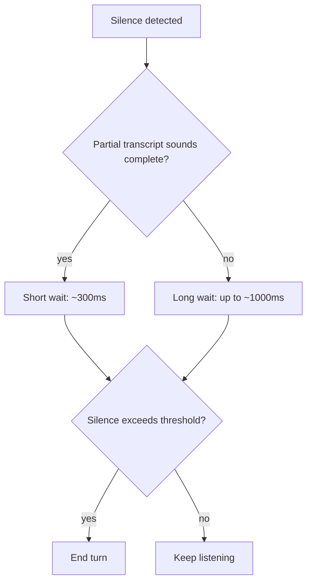

Yesterday's pipeline used VAD and turn-taking as a black box. This post opens that up — it's genuinely the hardest part of a voice pipeline to get right, and the part users notice most when it's wrong.



Fixed silence-duration thresholds are what cause both premature cutoffs and awkward over-long pauses — the adaptive approach in this post uses the content of the partial transcript itself to shorten or lengthen the wait, which is the single highest-leverage fix for turn-taking quality.

## What VAD Actually Does

```python
def is_speech_frame(audio_frame: bytes, threshold: float = 0.5) -> bool:
    energy = compute_frame_energy(audio_frame)
    speech_probability = vad_model.predict(audio_frame)
    return speech_probability > threshold
```

Modern VAD uses a lightweight model (not just energy thresholding) to distinguish speech from silence and background noise — energy-only VAD fails badly in noisy environments, flagging a passing car or background chatter as speech.

## The End-of-Turn Problem

Detecting "the user stopped making sound" is easy. Detecting "the user is *done speaking*" is not — a thoughtful pause mid-sentence looks identical to a completed turn from pure silence detection alone.

```python
def should_end_turn(silence_duration_ms: float, transcript_so_far: str) -> bool:
    ends_with_complete_thought = looks_grammatically_complete(transcript_so_far)
    silence_threshold = 400 if ends_with_complete_thought else 900
    return silence_duration_ms > silence_threshold
```

Using the *content* of the partial transcript to adjust the silence threshold — shorter wait after what looks like a complete sentence, longer wait after something that trails off mid-thought — meaningfully reduces both premature cutoffs and awkward over-long pauses, beyond what a fixed silence duration alone achieves.

## Semantic Turn Detection with a Fast Classifier

A more sophisticated approach uses a small, fast model to classify whether a partial transcript sounds complete, running continuously as transcription streams in:

```python
def classify_turn_completeness(partial_transcript: str) -> float:
    # A small, fast classifier — not a full LLM call, latency here is critical
    return turn_completeness_model.predict(partial_transcript)

def adaptive_end_of_turn(partial_transcript: str, silence_ms: float) -> bool:
    completeness = classify_turn_completeness(partial_transcript)
    required_silence = 300 + (1 - completeness) * 700  # 300ms if clearly complete, up to 1000ms if not
    return silence_ms > required_silence
```

This must be fast — a full LLM call for turn-detection adds exactly the latency the whole pipeline is trying to minimize, so a lightweight dedicated classifier (or even simple heuristics on sentence structure) is the right tool here, not a call to the main conversational model.

## Barge-In: Letting Users Interrupt Naturally

```python
def handle_potential_barge_in(new_speech_detected: bool, is_agent_speaking: bool, confidence: float) -> bool:
    if is_agent_speaking and new_speech_detected and confidence > 0.7:
        return True  # stop agent speech, start listening
    return False
```

Setting the confidence bar too low causes false interruptions from background noise; too high makes the agent feel unresponsive to genuine interruptions. Tune this against real usage recordings, not synthetic test audio, since real interruption acoustics (a user's voice overlapping with the agent's own speech being played back) differ meaningfully from clean isolated audio.

## Multi-Speaker Environments

For voice agents used in shared spaces (a kiosk, a conference room device), add speaker diarization to distinguish the intended user from background conversation — a nontrivial addition, but the alternative is a system that responds to any voice in the room, which is a real usability and even safety problem for many deployments.

## Testing Turn-Taking Quality Directly

Build a test set of real recorded conversations with human-labeled correct turn boundaries, and measure both false-cutoff rate (agent responded before the user finished) and hang-time (agent waited noticeably too long after the user finished) — both matter, and optimizing one in isolation tends to make the other worse.

---

*Part of the [Multimodal AI series]({{ site.baseurl }}/tags/multimodal-series/) — next, shifting to a new modality: [video understanding]({{ site.baseurl }}/posts/video-understanding-summarizing-searching/).*
