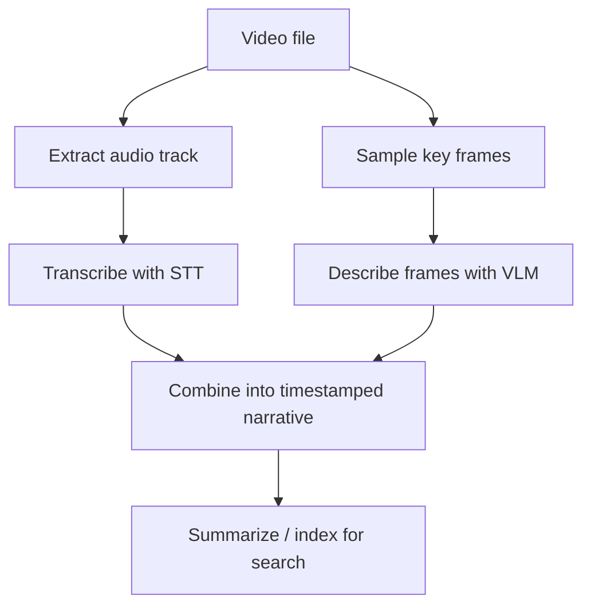

Video combines every modality covered so far — visual frames, audio, and often on-screen text — into a single, much larger artifact. Understanding it well means combining techniques from earlier this month rather than reaching for one new capability.

## The Decomposition Approach



No current mainstream API takes a raw video file and returns a deep understanding directly at reasonable cost for long content — the practical approach decomposes video into the modalities already covered this month and combines the results.

## Building a Timestamped Understanding

```python
def analyze_video(video_path: str) -> list[dict]:
    audio_path = extract_audio(video_path)
    transcript_segments = transcribe_with_timestamps(audio_path)  # from July's STT post

    key_frames = sample_key_frames(video_path, interval_seconds=10)  # tomorrow's post covers this in depth
    frame_descriptions = [
        {"timestamp": t, "description": describe_frame(frame)}
        for t, frame in key_frames
    ]

    return merge_by_timestamp(transcript_segments, frame_descriptions)
```

## Summarization Over the Combined Timeline

```python
def summarize_video(timeline: list[dict]) -> str:
    combined = "\n".join(f"[{seg['timestamp']}s] {seg.get('transcript', '')} {seg.get('visual', '')}" for seg in timeline)
    response = llm.chat([{
        "role": "user",
        "content": f"Video timeline:\n{combined}\n\nProduce a concise summary with key moments and their timestamps.",
    }])
    return response.content
```

Passing a combined timestamped timeline, rather than transcript and visual descriptions separately, lets the model reason about *correspondence* between what's said and what's shown — important for content where the meaning depends on both together (a demo video where narration references something happening on screen).

## Making Video Searchable

```python
def index_video_for_search(video_id: str, timeline: list[dict]):
    for segment in timeline:
        text = f"{segment.get('transcript', '')} {segment.get('visual', '')}"
        embedding = embed(text)
        vector_store.upsert(id=f"{video_id}-{segment['timestamp']}", vector=embedding,
                             payload={"video_id": video_id, "timestamp": segment["timestamp"], "text": text})

def search_videos(query: str, top_k: int = 5) -> list[dict]:
    results = vector_store.search(embed(query), top_k=top_k)
    return [{"video_id": r.payload["video_id"], "timestamp": r.payload["timestamp"], "jump_url": build_timestamp_url(r.payload)} for r in results]
```

This is directly the multimodal RAG pattern from earlier this month, applied at the video-segment level — a query returns not just "which video" but the specific timestamp to jump to, which is what makes video search genuinely useful rather than just document-level retrieval.

## Cost Reality for Long-Form Video

A one-hour video sampled every 10 seconds produces 360 frames — each a real VLM call cost. For long-form content, batch frame descriptions efficiently (multiple frames per VLM call where supported) and consider adaptive sampling — sparser during static talking-head segments, denser during visually dynamic content — covered in depth tomorrow.

## Live Video vs Pre-Recorded

Everything above assumes offline processing of a complete video file. Live video understanding (a security camera feed, a live stream) needs a fundamentally different, streaming-oriented architecture — sampling frames continuously and maintaining a rolling context window rather than processing a bounded file, closer in shape to the real-time voice pipeline from earlier this week than to a batch document pipeline.

---

*Part of the [Multimodal AI series]({{ site.baseurl }}/tags/multimodal-series/) — next: [frame sampling strategies]({{ site.baseurl }}/posts/frame-sampling-strategies-video-analysis/) in depth, the cost-quality lever this post deferred.*
