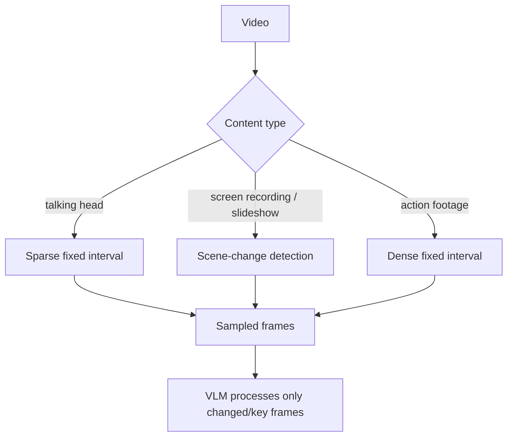

Yesterday's video pipeline sampled frames at a fixed 10-second interval — a reasonable default, but a real cost and quality lever worth its own treatment. Sample too sparsely and you miss visually important moments; too densely and cost scales with little added understanding.



Classifying content type upfront and routing to the matching sampling strategy is the core idea of this post — scene-change detection alone, with sensible min/max bounds, captures most of the benefit of the more elaborate adaptive strategies described further down.

## Fixed-Interval Sampling: The Baseline

```python
def sample_fixed_interval(video_path: str, interval_seconds: float = 10) -> list[tuple[float, bytes]]:
    duration = get_video_duration(video_path)
    timestamps = np.arange(0, duration, interval_seconds)
    return [(t, extract_frame_at(video_path, t)) for t in timestamps]
```

Simple, predictable cost, but wasteful on static content (a slide deck presentation where nothing changes for minutes) and potentially too sparse for fast-changing content (a sports highlight, a fast-cut montage).

## Scene-Change Detection: Sample Where Content Actually Changes

```python
def sample_on_scene_change(video_path: str, threshold: float = 0.3) -> list[tuple[float, bytes]]:
    frames = []
    prev_frame = None
    for t, frame in iterate_frames(video_path, step_seconds=1):
        if prev_frame is None or frame_difference(frame, prev_frame) > threshold:
            frames.append((t, frame))
            prev_frame = frame
    return frames
```

`frame_difference` — a cheap perceptual hash or histogram comparison, not a full VLM call — filters out redundant near-identical frames before any expensive VLM description happens, concentrating sampling exactly where the visual content is actually changing.

## Audio-Aware Sampling

Combine scene detection with the transcript from yesterday's pipeline — sample a frame whenever the narration references something visual ("as you can see here", "this chart shows"), not just on a fixed schedule:

```python
def sample_on_visual_reference(video_path: str, transcript_segments: list[dict]) -> list[tuple[float, bytes]]:
    visual_reference_phrases = ["as you can see", "shown here", "this chart", "in this image", "on screen"]
    reference_times = [
        seg["start"] for seg in transcript_segments
        if any(phrase in seg["text"].lower() for phrase in visual_reference_phrases)
    ]
    return [(t, extract_frame_at(video_path, t)) for t in reference_times]
```

This targets exactly the frames most likely to matter for understanding narrated content — a demo video's key moments are usually exactly when the narrator says "here" or "this," not evenly spaced throughout the recording.

## Adaptive Density Based on Content Type

```python
def adaptive_sample(video_path: str, content_type: str) -> list[tuple[float, bytes]]:
    intervals = {"talking_head": 30, "screen_recording": 5, "action_footage": 2, "slideshow": "scene_change"}
    strategy = intervals.get(content_type, 10)
    return sample_fixed_interval(video_path, strategy) if isinstance(strategy, (int, float)) else sample_on_scene_change(video_path)
```

Classifying content type upfront (even a cheap heuristic based on average scene-change frequency in the first minute) and choosing a sampling strategy accordingly avoids both over-sampling static content and under-sampling dynamic content with one fixed global setting.

## Measuring Whether a Sampling Strategy Is Good Enough

```python
def evaluate_sampling_coverage(video_path: str, sampled_frames: list, known_key_moments: list[dict]) -> float:
    covered = sum(
        1 for moment in known_key_moments
        if any(abs(t - moment["timestamp"]) < moment["tolerance_seconds"] for t, _ in sampled_frames)
    )
    return covered / len(known_key_moments)
```

Build a small golden set of videos with manually annotated "key moments that must be captured," and measure recall against it — the same golden-dataset evaluation discipline from June, applied to a sampling strategy rather than a text generation task.

## Cost-Quality Tradeoff in Practice

For most production use cases, scene-change detection with a sensible minimum and maximum interval (never sparser than every 30 seconds, never denser than every 2) captures the large majority of the benefit of more sophisticated adaptive strategies at a fraction of their implementation complexity — a reasonable default before investing further.

---

*Part of the [Multimodal AI series]({{ site.baseurl }}/tags/multimodal-series/) — next, back to documents: [building a document AI pipeline for PDFs at scale]({{ site.baseurl }}/posts/document-ai-pipeline-pdfs-scale/).*
