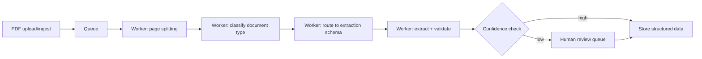

Everything from this month's document posts — OCR, table extraction, structured extraction — needs to run reliably across thousands of PDFs, not just one at a time in a notebook. This post assembles those pieces into a production batch pipeline.

## Architecture



## Queue-Based Processing for Throughput

```python
def enqueue_document(pdf_path: str, doc_id: str):
    queue.push({"doc_id": doc_id, "path": pdf_path, "status": "pending"})

def worker_loop():
    while True:
        job = queue.pop(timeout=30)
        if job is None:
            continue
        try:
            process_document(job)
        except Exception as e:
            handle_processing_failure(job, e)
```

A queue-based architecture, not a synchronous loop, is what lets extraction throughput scale horizontally — add more workers when volume grows, without changing the processing logic itself.

## Document Classification Before Extraction

```python
def classify_document_type(first_page_image: bytes) -> str:
    response = client.messages.create(
        model="claude-haiku-4-5", max_tokens=50,  # cheap, fast model — this is a simple classification
        messages=[{"role": "user", "content": [
            {"type": "image", "source": {"type": "base64", "media_type": "image/png", "data": base64.b64encode(first_page_image).decode()}},
            {"type": "text", "text": "Classify this document: invoice, contract, resume, form, or other."},
        ]}],
    )
    return response.content[0].text.strip().lower()
```

Routing each document to the correct extraction schema based on classified type — echoing April's model-routing pattern — means using a cheap, fast model for classification and reserving the more expensive extraction call for the actual structured output step.

## Idempotent Processing for Safe Retries

```python
def process_document(job: dict):
    if is_already_processed(job["doc_id"]):
        return  # safe to re-run the same job without double-processing
    doc_type = classify_document_type(get_first_page(job["path"]))
    schema = SCHEMA_REGISTRY[doc_type]
    result = extract_with_schema(job["path"], schema)
    store_result(job["doc_id"], result, status="processed")
```

Checking `is_already_processed` before doing real work is the idempotency principle from April's state-management post, applied here — a worker crash mid-processing shouldn't cause a document to be extracted (and billed) twice on retry.

## Batching for Cost Efficiency

```python
def batch_process(pdf_batch: list[str], batch_size: int = 10) -> list[dict]:
    results = []
    for chunk in chunked(pdf_batch, batch_size):
        results.extend(asyncio.run(process_batch_concurrent(chunk)))
    return results

async def process_batch_concurrent(chunk: list[str]) -> list[dict]:
    semaphore = asyncio.Semaphore(5)  # respect provider rate limits
    async def bounded_process(path):
        async with semaphore:
            return await extract_document_async(path)
    return await asyncio.gather(*[bounded_process(p) for p in chunk])
```

## Monitoring the Pipeline

Apply June's observability stack directly: track extraction success rate, average confidence score, human-review queue depth, and cost per document processed, with alerting on any of these drifting outside expected range — a sudden spike in human-review-queue depth is often the earliest signal that a new document format has entered the pipeline unhandled.

## Continuous Improvement from Human Review

```python
def process_reviewed_correction(doc_id: str, corrected_data: dict, original_extraction: dict):
    if corrected_data != original_extraction:
        add_to_golden_set(doc_id, corrected_data, doc_type=get_doc_type(doc_id))
```

Every human correction is a candidate golden set addition — the same feedback loop from June's continuous evaluation post, closing back into this pipeline's own extraction quality over time.

---

*Part of the [Multimodal AI series]({{ site.baseurl }}/tags/multimodal-series/) — next: [handwriting recognition]({{ site.baseurl }}/posts/handwriting-recognition-vision-models/), one of the document types most likely to need human review routing.*
