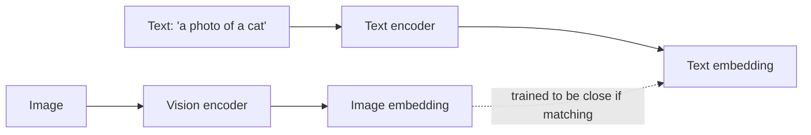

Every multimodal RAG example earlier this month used the "describe the image as text, embed the description" workaround. CLIP-style models take a fundamentally different approach: embedding images and text directly into the *same* vector space, no text description intermediate step required.

## How CLIP Works, Conceptually



CLIP (Contrastive Language-Image Pretraining) trains two encoders — one for images, one for text — jointly, on massive datasets of image-caption pairs, with a contrastive objective that pulls matching pairs' embeddings close together and pushes non-matching pairs apart. The result: a text query and a matching image land near each other in the same embedding space, without any generative model in between.

## Using CLIP for Image-Text Similarity

```python
from transformers import CLIPModel, CLIPProcessor

model = CLIPModel.from_pretrained("openai/clip-vit-base-patch32")
processor = CLIPProcessor.from_pretrained("openai/clip-vit-base-patch32")

def embed_image(image) -> np.ndarray:
    inputs = processor(images=image, return_tensors="pt")
    return model.get_image_features(**inputs).detach().numpy()[0]

def embed_text(text: str) -> np.ndarray:
    inputs = processor(text=[text], return_tensors="pt", padding=True)
    return model.get_text_features(**inputs).detach().numpy()[0]

similarity = cosine_similarity(embed_image(product_photo), embed_text("a red running shoe"))
```

## Why This Matters for Multimodal RAG

Reconsider the multimodal RAG architecture from earlier this month — with CLIP-style embeddings, you skip the ingestion-time "generate a text description" VLM call entirely, embedding images directly and searching against a text query embedded in the same space:

```python
def clip_multimodal_search(query: str, top_k: int = 5) -> list[dict]:
    query_embedding = embed_text(query)
    return vector_store.search(query_embedding, top_k=top_k)  # searches both image and text embeddings in one index
```

This is cheaper at ingestion time (no per-image VLM call needed) and captures visual detail a text description might have missed or summarized away — at the cost of somewhat less semantically nuanced matching than an LLM-generated description would provide for complex scenes.

## CLIP's Known Limitations

- **Weaker at fine-grained distinctions** — CLIP is good at broad categorical matching ("a dog" vs "a car") but less reliable at fine-grained detail matching ("a golden retriever" vs "a labrador") than a VLM's actual language-model reasoning
- **No compositional reasoning** — CLIP can't reason about spatial relationships or counts the way a full VLM prompted appropriately can ("the cat to the left of the lamp")
- **Trained on web-scraped captions** — inherits whatever biases and gaps exist in that training distribution, worth testing explicitly for domain-specific or underrepresented content

## Beyond CLIP: SigLIP and Other Variants

Newer multimodal embedding models (SigLIP and others) improve on CLIP's original contrastive objective and generally offer better retrieval accuracy at similar computational cost — worth benchmarking against your specific retrieval task rather than defaulting to the original CLIP, following the same task-specific evaluation discipline from June's provider comparison post.

## When to Use CLIP-Style Embeddings vs VLM Descriptions

Use direct multimodal embeddings for large-scale, latency-sensitive image retrieval where broad categorical matching is sufficient. Use VLM-generated text descriptions when retrieval needs to capture fine-grained or compositional detail that CLIP-style embeddings would miss — often the right answer is combining both, using CLIP for a fast first-pass candidate retrieval and a VLM for reranking the top candidates.

---

*Part of the [Multimodal AI series]({{ site.baseurl }}/tags/multimodal-series/) — next: [building an image search engine with CLIP]({{ site.baseurl }}/posts/image-search-engine-clip/) end to end.*
