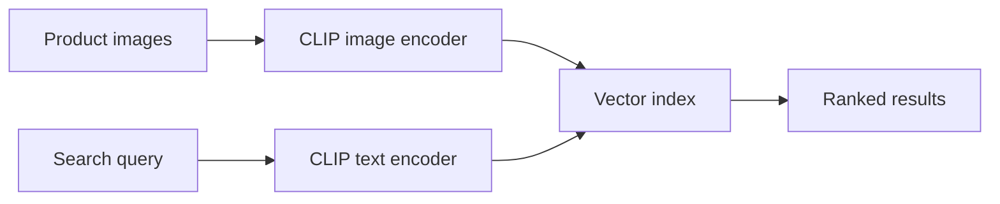

A worked example applying yesterday's CLIP embeddings to a complete text-to-image search feature — search a product catalog by natural-language description, no manual tagging required.

## Architecture



## Indexing a Product Catalog

```python
def index_product_catalog(products: list[dict]):
    for product in products:
        image = load_image(product["image_path"])
        embedding = embed_image(image)
        vector_store.upsert(
            id=product["id"], vector=embedding,
            payload={"name": product["name"], "price": product["price"], "image_url": product["image_url"]},
        )
```

## The Search Endpoint

```python
@app.get("/search")
async def search_products(query: str, top_k: int = 20):
    query_embedding = embed_text(query)
    results = vector_store.search(query_embedding, top_k=top_k)
    return [{"id": r.id, "name": r.payload["name"], "price": r.payload["price"],
             "image_url": r.payload["image_url"], "score": r.score} for r in results]
```

A search for "blue running shoes with white soles" now returns relevant products purely from their photos, with zero manual tagging effort — this is the practical payoff of shared embedding space from yesterday's post: natural language directly retrieves visually matching content.

## Combining Text and Image Search in One Query

For "find products similar to this photo, but in red" style queries, CLIP embeddings can be combined:

```python
def combined_search(reference_image, modifier_text: str, top_k: int = 20):
    image_embedding = embed_image(reference_image)
    text_embedding = embed_text(modifier_text)
    combined_embedding = normalize(image_embedding * 0.6 + text_embedding * 0.4)  # weighted combination
    return vector_store.search(combined_embedding, top_k=top_k)
```

The weighting between image and text influence is a tunable parameter worth evaluating against real query patterns — a pure visual-similarity search versus a search meaningfully steered by the text modifier are different products, and the right balance depends on how your users actually phrase these hybrid queries.

## Reranking with a VLM for Better Precision

Using CLIP for fast candidate retrieval (top 50) and a VLM for precise reranking of those candidates (down to a final top 10) combines CLIP's speed advantage with a VLM's stronger fine-grained reasoning, echoing yesterday's post on their complementary strengths:

```python
def rerank_with_vlm(query: str, candidates: list[dict]) -> list[dict]:
    scored = []
    for candidate in candidates:
        response = client.messages.create(model="claude-haiku-4-5", max_tokens=10, messages=[{
            "role": "user", "content": [
                {"type": "image", "source": {"type": "base64", "media_type": "image/png", "data": get_image_b64(candidate)}},
                {"type": "text", "text": f"Rate 0-10 how well this matches: '{query}'. Respond with only the number."},
            ],
        }])
        scored.append({**candidate, "vlm_score": float(response.content[0].text.strip())})
    return sorted(scored, key=lambda x: -x["vlm_score"])
```

## Evaluating Search Quality

Build a golden set of query-to-expected-result pairs from real search logs (echoing June's evaluation series directly), measuring recall@k and click-through rate on live search results — CLIP-based search quality is genuinely dependent on your specific catalog's visual diversity, and generic benchmarks won't substitute for evaluating on your own data.

## Handling Catalog Updates

```python
def on_product_added(product: dict):
    embedding = embed_image(load_image(product["image_path"]))
    vector_store.upsert(id=product["id"], vector=embedding, payload=product)
```

Incremental indexing on catalog changes, rather than periodic full reindexing, keeps search results current without the latency and cost of reprocessing an entire catalog on every update.

---

*Part of the [Multimodal AI series]({{ site.baseurl }}/tags/multimodal-series/) — next: [combining vision and function calling]({{ site.baseurl }}/posts/vision-function-calling-visual-agents/) for agents that act on what they see.*
