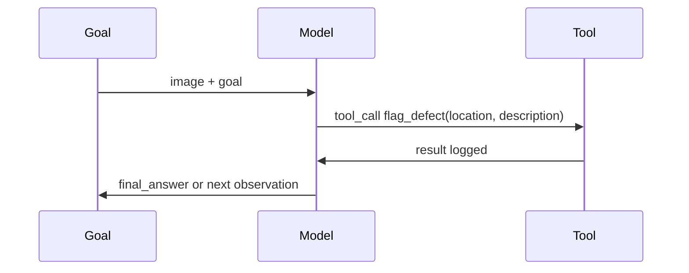

Everything in this month's series so far has been about understanding or generating visual content. This post connects that to March and April's agent material — a visual agent that *sees* something and *acts* on it, closing the loop between perception and tool use.



Structurally this is exactly March's ReAct loop — the only difference is that the "observation" feeding the reasoning is an image, and the model's tool-call decision (flag a defect, request a closer photo) is grounded in what it sees rather than in text alone.

## The Pattern: Vision Feeds the Reasoning Loop

```python
def visual_agent_step(image_bytes: bytes, goal: str, tools: dict) -> dict:
    response = client.messages.create(
        model="claude-sonnet-5", max_tokens=1024,
        tools=list(tools.values()),
        messages=[{"role": "user", "content": [
            {"type": "image", "source": {"type": "base64", "media_type": "image/png", "data": base64.b64encode(image_bytes).decode()}},
            {"type": "text", "text": goal},
        ]}],
    )
    if response.tool_calls:
        for call in response.tool_calls:
            result = tools[call.name](**call.arguments)
            return {"action": call.name, "result": result}
    return {"final_answer": response.content}
```

Structurally, this is exactly the ReAct loop from March — the only difference is that the "observation" feeding the reasoning can be an image, not just text, and the model's tool-call decision can be grounded in what it sees.

## A Worked Example: A Visual Inspection Agent

```python
tools = {
    "flag_defect": flag_defect,
    "request_closer_photo": request_closer_photo,
    "log_pass": log_pass,
}

def inspect_product_photo(image_bytes: bytes) -> dict:
    return visual_agent_step(
        image_bytes,
        goal="Inspect this product photo for visible defects (scratches, dents, misalignment). "
             "Flag any defect found with a description, or log a pass if none found. "
             "If the image quality is too poor to assess confidently, request a closer photo.",
        tools=tools,
    )
```

Including "request a closer photo" as an available tool — not just pass/fail — is what gives the agent a way to express "I can't tell from this image" rather than being forced into an overconfident binary judgment, echoing the calibrated-uncertainty principle from earlier posts this month.

## Multi-Step Visual Agents: Combining Screenshots and Actions

For a browser or computer-use agent (from April), each step's "observation" is itself a screenshot — visual agents and browser/computer-use agents are the same underlying pattern, with the tool set determining whether the agent acts on a UI, a physical inspection workflow, or something else entirely:

```python
def visual_ui_agent_step(screenshot: bytes, goal: str, ui_tools: dict) -> dict:
    return visual_agent_step(screenshot, goal, ui_tools)  # same function, different tools registered
```

## Grounding Tool Arguments in Visual Detail

A visual agent's tool calls often need arguments derived directly from what's in the image — not just "flag_defect()" but "flag_defect(location='top-left corner', description='hairline scratch approximately 2cm')". Prompting explicitly for this level of grounding detail produces tool calls useful for downstream action, rather than vague flags a human still has to manually re-inspect to act on.

## Evaluating a Visual Agent

Apply March's agent-evaluation framework directly, with a golden set of images paired with the expected tool call and arguments — including deliberately ambiguous or low-quality images to verify the agent correctly falls back to "request more information" rather than guessing, the same graceful-uncertainty test pattern from the handwriting and chart posts earlier this month.

## Cost and Latency Considerations Specific to Visual Agents

Every step in a visual agent loop that includes a fresh image (a new screenshot, a new photo) carries the image-token cost from the very first post this month, on top of the usual per-step reasoning cost — budget and monitor accordingly, since a multi-step visual agent can accumulate cost faster than a text-only equivalent.

---

*Part of the [Multimodal AI series]({{ site.baseurl }}/tags/multimodal-series/) — next: [accessibility applications]({{ site.baseurl }}/posts/accessibility-applications-multimodal-ai/), a use case where multimodal AI delivers some of its clearest real-world value.*
