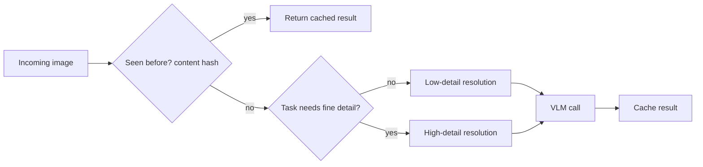

Every post this month has mentioned image-token cost in passing. This post pulls that thread together — multimodal pipelines have a fundamentally different cost structure than text-only ones, and the optimization levers are different too.



Caching and resolution choice are the two highest-leverage levers this post covers — skipping the VLM call entirely for a previously seen image, and defaulting to low-detail processing unless a task genuinely needs fine-grained reading, together address the two most common sources of wasted multimodal spend.

## Why Multimodal Cost Scales Differently

A single high-resolution image can cost as much in tokens as several paragraphs of text — and a document pipeline processing hundreds of pages, or a video pipeline sampling hundreds of frames, multiplies that per-image cost across the whole batch. The cost-per-request intuition built up over text-only work in earlier months under-predicts multimodal cost significantly if applied naively.

## The Core Optimization Levers

```python
optimization_levers = {
    "resolution": "use low-detail mode unless fine detail is genuinely needed (July 1)",
    "sampling_density": "scene-change detection over fixed intervals for video (July 17)",
    "model_tier": "route classification/simple tasks to a cheap model, reserve capable models for complex reasoning (July 18)",
    "caching": "cache descriptions/extractions for unchanged content, don't reprocess",
    "batching": "batch multiple images per request where the API supports it",
}
```

## Caching Multimodal Results

```python
def get_or_compute_description(image_bytes: bytes) -> str:
    content_hash = hashlib.sha256(image_bytes).hexdigest()
    cached = cache.get(f"img-description:{content_hash}")
    if cached:
        return cached
    description = generate_image_description(image_bytes)
    cache.set(f"img-description:{content_hash}", description, ttl=30 * 86400)
    return description
```

Content-hash-based caching matters more for multimodal pipelines than text ones — the same product photo, the same document template, or the same video thumbnail is likely to recur across a real workload, and reprocessing identical images is pure waste.

## Resolution as the Single Highest-Leverage Lever

```python
def choose_resolution(task_type: str) -> str:
    high_detail_tasks = {"table_extraction", "handwriting", "small_text_reading", "chart_precise_values"}
    return "high" if task_type in high_detail_tasks else "low"
```

Defaulting every image to high-detail processing when most tasks (general scene description, broad classification) don't need it is the single most common multimodal cost mistake — apply the task-specific resolution choice explicitly rather than a blanket default.

## Latency: Multimodal Requests Are Slower, Budget Accordingly

Image and video processing adds real latency beyond a comparable text-only request — encoding, upload bandwidth for large images, and longer model processing time all stack. Apply June's latency-budget framework with multimodal-specific stage breakdowns:

```python
multimodal_latency_budget = {
    "image_encode_upload": 200,     # ms — can be significant for large images over slow connections
    "vlm_processing": 1500,
    "total": 2000,
}
```

Compress and resize images client-side before upload where quality permits — a 20MB photo uploaded over a slow mobile connection can dominate total latency more than the actual model processing time.

## Parallel Processing for Batch Workloads

```python
async def process_images_parallel(image_batch: list[bytes], max_concurrent: int = 5) -> list[dict]:
    semaphore = asyncio.Semaphore(max_concurrent)
    async def bounded_process(img):
        async with semaphore:
            return await process_image_async(img)
    return await asyncio.gather(*[bounded_process(img) for img in image_batch])
```

For batch pipelines (the document AI pipeline from earlier this month), parallelizing within provider rate limits is what makes throughput acceptable at real volume — sequential processing of a large image batch is rarely viable in production.

## Measuring and Monitoring Multimodal-Specific Cost

Extend June's cost-monitoring dashboard with a breakdown by content type (image vs text vs audio tokens) — multimodal cost often hides inside an aggregate "LLM spend" number until broken out explicitly, at which point it's frequently the dominant line item for any vision-heavy feature.

---

*Part of the [Multimodal AI series]({{ site.baseurl }}/tags/multimodal-series/) — next: [fine-tuning vision-language models]({{ site.baseurl }}/posts/fine-tuning-vlms-domain-tasks/) for domain-specific tasks, extending May's fine-tuning series to multimodal models.*
