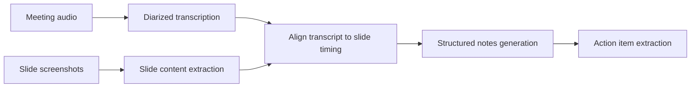

A complete worked example combining this month's audio and vision techniques: a meeting recording plus the presented slides in, structured notes with action items out.

## Architecture



## Transcription with Speaker Diarization

```python
def transcribe_meeting(audio_path: str) -> list[dict]:
    result = assemblyai_client.transcribe(audio_path, config={"speaker_labels": True})
    return [{"speaker": u.speaker, "text": u.text, "start": u.start, "end": u.end} for u in result.utterances]
```

## Extracting Slide Content

```python
def extract_slide_content(slide_images: list[tuple[float, bytes]]) -> list[dict]:
    return [
        {"timestamp": t, "content": extract_slide_text_and_structure(img)}
        for t, img in slide_images
    ]

def extract_slide_text_and_structure(image_bytes: bytes) -> dict:
    response = client.messages.create(
        model="claude-sonnet-5", max_tokens=1024,
        messages=[{"role": "user", "content": [
            {"type": "image", "source": {"type": "base64", "media_type": "image/png", "data": base64.b64encode(image_bytes).decode()}},
            {"type": "text", "text": "Extract this slide's title, bullet points, and any chart/data shown, as JSON."},
        ]}],
    )
    return json.loads(response.content[0].text)
```

## Aligning Transcript to Slides by Timestamp

```python
def align_transcript_to_slides(transcript: list[dict], slides: list[dict]) -> list[dict]:
    aligned = []
    for slide in slides:
        next_slide_time = get_next_slide_time(slide, slides)
        relevant_utterances = [u for u in transcript if slide["timestamp"] <= u["start"] < next_slide_time]
        aligned.append({"slide": slide["content"], "discussion": relevant_utterances})
    return aligned
```

This mirrors the video-understanding timeline-merging pattern from earlier this month — combining two timestamped modalities (here, discrete slide changes and continuous speech) into one coherent structure the generation step can reason over.

## Generating Structured Notes

```python
def generate_meeting_notes(aligned_content: list[dict], attendees: list[str]) -> dict:
    context = "\n\n".join(
        f"Slide: {a['slide']['title']}\nDiscussion:\n" +
        "\n".join(f"  {u['speaker']}: {u['text']}" for u in a["discussion"])
        for a in aligned_content
    )
    response = llm.chat([{
        "role": "user",
        "content": f"Meeting attendees: {attendees}\n\n{context}\n\n"
                    f"Produce structured notes: key decisions, discussion summary per topic, "
                    f"and action items with owner (infer from who spoke about it) and any mentioned deadline."
    }])
    return parse_structured_notes(response.content)
```

## Action Item Extraction as a Separate, Validated Step

```python
class ActionItem(BaseModel):
    description: str
    owner: str | None
    deadline: date | None
    source_quote: str  # traceable back to who actually said it

def extract_action_items(notes_context: str) -> list[ActionItem]:
    response = llm.chat([{"role": "user", "content": f"Extract action items as JSON list matching schema. Context: {notes_context}"}])
    items = [ActionItem.model_validate(item) for item in json.loads(response.content)]
    return items
```

Requiring a `source_quote` for every extracted action item — traceable back to the actual transcript — gives reviewers a way to verify each item against the source rather than trusting the extraction blindly, the same traceability principle from the invoice-extraction post's confidence-routing pattern.

## Delivering the Output

```python
def deliver_notes(notes: dict, action_items: list[ActionItem], attendees: list[str]):
    formatted = render_notes_markdown(notes, action_items)
    for attendee in attendees:
        send_notification(attendee, formatted)
    create_tasks_in_project_tool(action_items)
```

## Evaluating This Pipeline

Build a golden set of real (anonymized) meeting recordings with human-written reference notes, and score generated notes on coverage of key decisions and action-item extraction accuracy — the multi-dimensional evaluation approach from June, applied to a genuinely useful production multimodal feature.

---

*Part of the [Multimodal AI series]({{ site.baseurl }}/tags/multimodal-series/) — next: [screenshot-to-code]({{ site.baseurl }}/posts/screenshot-to-code-generating-ui/), a different but related generation task.*
