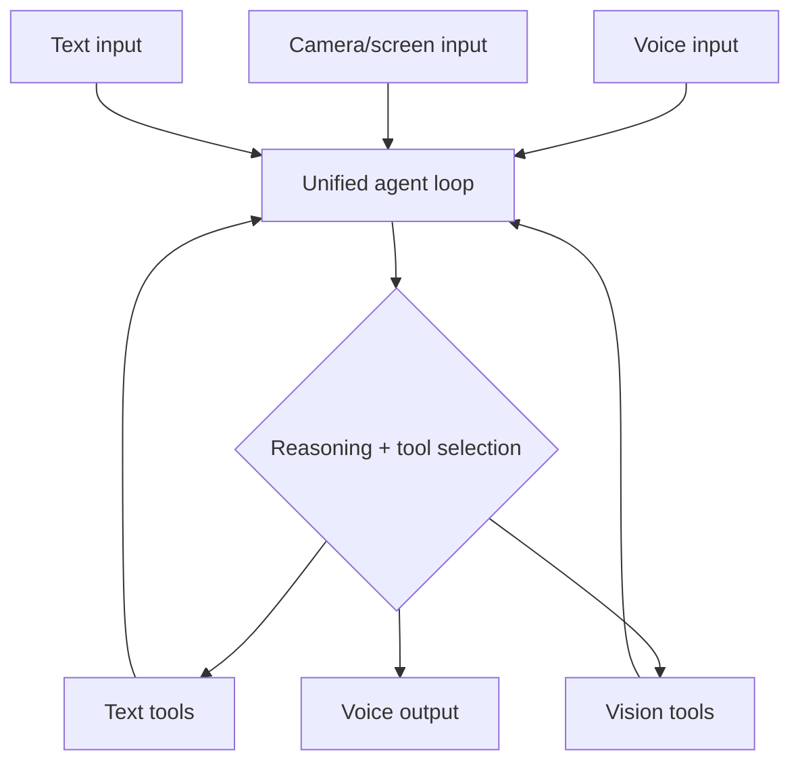

Every modality this month has been covered mostly in isolation. A genuinely multimodal agent combines vision, audio, and action in one reasoning loop — the natural convergence point of this month's series with March and April's agent material.

## Architecture: One Loop, Multiple Perception Channels



## A Unified Perception Interface

```python
class MultimodalObservation:
    def __init__(self, text: str | None = None, image: bytes | None = None, audio_transcript: str | None = None):
        self.text = text
        self.image = image
        self.audio_transcript = audio_transcript

    def to_content_blocks(self) -> list[dict]:
        blocks = []
        if self.image:
            blocks.append({"type": "image", "source": {"type": "base64", "media_type": "image/png",
                                                         "data": base64.b64encode(self.image).decode()}})
        combined_text = " ".join(filter(None, [self.text, self.audio_transcript]))
        if combined_text:
            blocks.append({"type": "text", "text": combined_text})
        return blocks
```

Normalizing every perception channel into one common content-block format before it enters the agent loop is what keeps the loop itself modality-agnostic — the reasoning and tool-selection logic doesn't need to know or care whether an observation originated from a camera, a microphone, or typed text.

## The Loop

```python
def multimodal_agent_step(observation: MultimodalObservation, history: list[dict], tools: dict) -> dict:
    messages = history + [{"role": "user", "content": observation.to_content_blocks()}]
    response = client.messages.create(model="claude-sonnet-5", max_tokens=1024, tools=list(tools.values()), messages=messages)

    if response.tool_calls:
        results = [execute_tool(call, tools) for call in response.tool_calls]
        return {"type": "tool_results", "results": results}
    return {"type": "response", "text": response.content, "audio": synthesize_speech(response.content)}
```

## A Worked Example: A Physical-World Assistant Agent

```python
tools = {
    "identify_object": identify_object_in_view,      # vision tool
    "read_text_in_view": read_visible_text,           # OCR-style vision tool
    "set_reminder": set_reminder,                      # action tool
    "search_web": search_web,                          # information tool
}

async def assistant_turn(camera_frame: bytes, voice_input_audio):
    transcript = await transcribe(voice_input_audio)
    observation = MultimodalObservation(image=camera_frame, audio_transcript=transcript)
    result = multimodal_agent_step(observation, conversation_history, tools)
    if result["type"] == "response":
        await play_audio(result["audio"])
    return result
```

A user pointing their camera at a product and asking "how much does this cost and is it in stock" combines visual identification, a tool call to check inventory, and a spoken answer — genuinely impossible to express cleanly as a single-modality system, and a natural fit for this unified loop.

## Guardrails Compound Across Modalities

Every guardrail category from March (budgets, confirmation for irreversible actions) and this month's guardrails post (unsafe content filtering) applies simultaneously in a multimodal agent — and the surface area for something to go wrong is correspondingly larger. A visual misidentification feeding into an irreversible action (identifying the wrong physical item before triggering a purchase) is a new failure mode worth explicit test coverage, not just a theoretical combination of two known risks.

## Evaluating a Multimodal Agent End to End

Combine March's task-success-rate agent evaluation with this month's multimodal-specific golden datasets — build test scenarios spanning realistic combinations of visual and audio input, including deliberately degraded input quality, and measure task success rate the same way March's post did for text-only agents.

---

*Part of the [Multimodal AI series]({{ site.baseurl }}/tags/multimodal-series/) — closing tomorrow with [a complete multimodal application walkthrough]({{ site.baseurl }}/posts/complete-multimodal-application-walkthrough/) tying the entire month together.*
