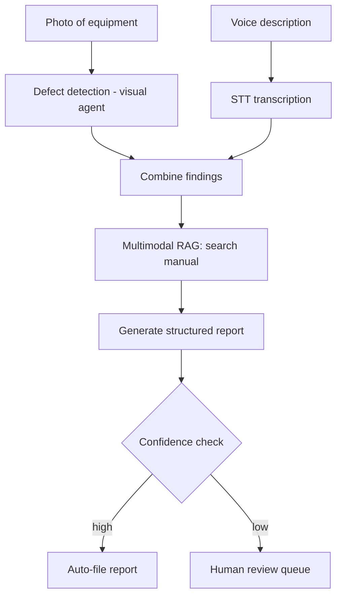

This closes out July by building one complete application — a field service inspection assistant — end to end, touching nearly every technique covered this month in the order a real project would assemble them.

## The Product

A technician photographs equipment, describes an issue by voice, and gets back a structured inspection report with flagged defects, referencing the manufacturer's manual (as PDF) for repair guidance.

## Full Architecture



## Step 1: Visual Defect Detection

```python
def inspect_equipment_photo(image_bytes: bytes) -> dict:
    return visual_agent_step(
        image_bytes,
        goal="Inspect for visible defects: corrosion, cracks, leaks, misalignment. "
             "For each found, note location and severity. Flag if image quality is insufficient.",
        tools={"flag_defect": flag_defect, "request_better_photo": request_better_photo},
    )
```

## Step 2: Voice Description, Transcribed

```python
async def capture_technician_notes(audio_stream) -> str:
    transcript = ""
    async for partial in stream_transcribe(audio_stream):
        transcript = partial
    return transcript
```

## Step 3: Multimodal RAG Against the Equipment Manual

```python
def find_relevant_manual_sections(defects: list[dict], equipment_model: str) -> list[dict]:
    results = []
    for defect in defects:
        query = f"{equipment_model} {defect['type']} {defect['location']} repair procedure"
        results.extend(multimodal_search(query, top_k=3))  # July's multimodal RAG pattern
    return results
```

## Step 4: Structured Report Generation

```python
class InspectionReport(BaseModel):
    equipment_id: str
    defects_found: list[dict]
    technician_notes: str
    recommended_actions: list[str]
    manual_references: list[str]
    overall_severity: Literal["none", "minor", "moderate", "critical"]
    confidence: Literal["high", "medium", "low"]

def generate_report(defects, transcript, manual_context, equipment_id) -> InspectionReport:
    response = llm.chat([{
        "role": "user",
        "content": f"Equipment: {equipment_id}\nVisual findings: {defects}\nTechnician notes: {transcript}\n"
                    f"Manual context: {manual_context}\n\nGenerate a structured inspection report as JSON matching the schema, "
                    f"citing manual sections for recommended actions."
    }])
    return InspectionReport.model_validate_json(response.content)
```

## Step 5: Confidence-Gated Routing

```python
def process_inspection(image_bytes, audio_stream, equipment_id):
    defects = inspect_equipment_photo(image_bytes)
    notes = capture_technician_notes(audio_stream)
    manual_context = find_relevant_manual_sections(defects["results"], equipment_id)
    report = generate_report(defects, notes, manual_context, equipment_id)

    if report.confidence == "high" and report.overall_severity != "critical":
        file_report(report)
    else:
        route_to_human_review(report, reason=f"confidence={report.confidence}, severity={report.overall_severity}")
    return report
```

Critical-severity findings always route to human review regardless of confidence — a deliberate guardrail from earlier this month's principle that high-stakes outcomes deserve human confirmation even when the system is technically confident.

## Evaluation and Monitoring

The full stack from June, applied here: a golden set of real (or realistic synthetic) inspection scenarios, a CI regression gate on report quality, production sampling with the multimodal faithfulness check from yesterday, cost and latency dashboards broken out by modality, and a postmortem process for any missed defect a human review later catches.

## What This Month Demonstrated

Every technique — vision understanding, document extraction, multimodal RAG, voice pipelines, guardrails, evaluation — exists to compose into applications like this one. None of it is valuable in isolation; the discipline is in assembling the pieces with the same rigor (confidence gating, human-in-the-loop for high stakes, continuous evaluation) that the rest of this roadmap has built up since March.

## What's Next

August turns to the infrastructure layer underneath everything built so far — inference serving, GPU infrastructure, caching, and scaling the systems from every prior month to real production traffic volume.

---

*Part of the [Multimodal AI series]({{ site.baseurl }}/tags/multimodal-series/) — the final post in this series, leading into the [AI Infrastructure & Scaling series]({{ site.baseurl }}/tags/ai-infra-series/) starting tomorrow.*
