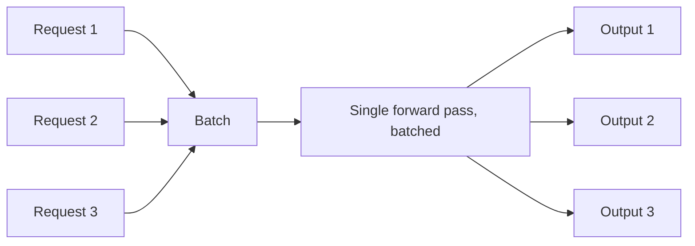

Every post so far in this roadmap has called an API and gotten a response back, treating the model-serving layer as a black box. August opens that box — understanding how an inference server actually works is what makes every subsequent optimization in this series make sense, rather than feeling like arbitrary tuning knobs.

## The Naive Approach and Why It Doesn't Scale

```python
# The naive version: one model instance, one request at a time
def naive_serve(request):
    return model.generate(request.prompt)  # blocks until fully done, no concurrency
```

A GPU running one request at a time sits mostly idle — most of an LLM forward pass's time is spent on memory bandwidth-bound operations, not raw compute, meaning a GPU serving one request rarely saturates its actual capacity. Everything in this series exists to close that gap.

## The Core Insight: Batching



Processing multiple requests' tokens together in one batched forward pass amortizes the fixed cost of loading model weights from GPU memory across many requests at once — dramatically improving throughput versus serving requests sequentially. This single idea is the foundation of every inference server covered this month.

## Why Naive Batching Still Isn't Enough

Static batching — waiting to accumulate a fixed batch size before running a forward pass — has an obvious problem for LLMs specifically: different requests finish generating at different lengths. A naive batch has to wait for the *longest* request in the batch to finish before returning any results, wasting capacity on every shorter request that finished early but is stuck waiting.

```python
def naive_batch_serve(requests: list, batch_size: int = 8):
    batch = accumulate_until_full(requests, batch_size)
    results = model.generate_batch(batch)  # blocks until the longest request completes
    return results
```

This is exactly the problem continuous batching (tomorrow's vLLM post) solves — and it's why a from-scratch inference implementation is rarely the right call once you understand what a purpose-built server handles for you.

## The Serving Stack, Layer by Layer

```python
serving_stack = {
    "model_weights": "loaded once, shared across requests",
    "kv_cache": "per-request memory, grows with sequence length (Thursday's post)",
    "scheduler": "decides which requests to batch together each step",
    "batching_engine": "runs the actual batched forward passes",
    "api_layer": "HTTP/gRPC interface, request queuing, auth",
]
```

## Throughput vs Latency: The Fundamental Tension

Larger batches improve throughput (total tokens/second across all requests) but can increase per-request latency (an individual request may wait longer for its batch to be ready, or share compute with more concurrent requests). Every inference server this month exposes tuning knobs that trade between these two — and the right setting depends entirely on whether your workload is latency-sensitive (an interactive chat) or throughput-sensitive (a batch processing job).

## Why This Series Matters Even If You Only Use Managed APIs

Even if your team never self-hosts a model, understanding this layer explains *why* managed API providers price and rate-limit the way they do, why latency varies with load, and what levers exist (batch size, request shaping) that are still within your control even when calling someone else's API — directly relevant to the cost and latency optimization techniques covered throughout this series.

---

*Part of the [AI Infrastructure series]({{ site.baseurl }}/tags/ai-infra-series/) — following July's [Multimodal AI series]({{ site.baseurl }}/tags/multimodal-series/).*
