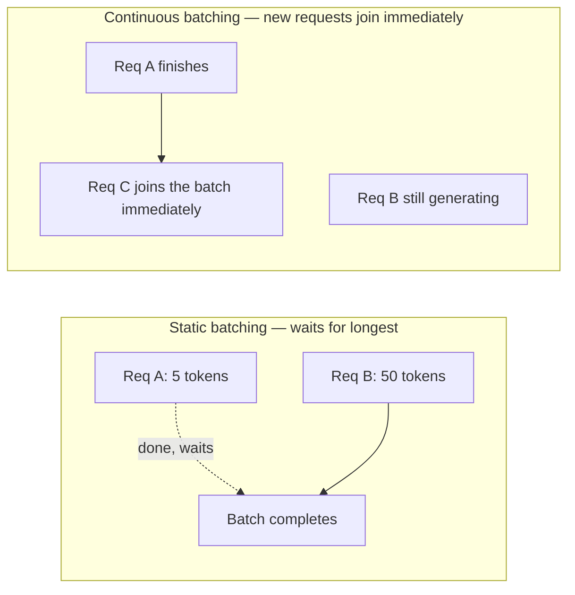

vLLM is the most widely adopted open-source inference server for self-hosted LLMs, and its adoption traces directly to two innovations that solve exactly the naive-batching problem from yesterday's post.

## Continuous Batching: Never Wait for the Slowest Request



Instead of waiting for every request in a batch to finish before starting a new one, continuous batching (also called in-flight batching) adds a new request to the batch the moment any slot frees up — a finished request's slot is immediately reused, keeping GPU utilization consistently high rather than dropping between fixed batch cycles.

## PagedAttention: Solving KV Cache Memory Waste

Tomorrow's post covers the KV cache in depth, but the short version needed here: each request's KV cache grows as it generates tokens, and naive implementations pre-allocate a large contiguous memory block per request sized for the maximum possible sequence length — wasting most of that memory for requests that finish early.

```python
# Naive: pre-allocate for worst case, waste memory on short sequences
kv_cache_naive = allocate_contiguous(max_seq_len=4096)  # wasteful if actual output is 200 tokens

# PagedAttention: allocate in small fixed-size blocks, like OS virtual memory paging
kv_cache_paged = allocate_blocks(block_size=16)  # grows incrementally, no pre-allocated waste
```

PagedAttention borrows the concept of memory paging from operating systems — the KV cache is stored in small, fixed-size blocks that get allocated on demand as a sequence grows, rather than one large upfront reservation. This is what lets vLLM pack dramatically more concurrent requests into the same GPU memory.

## Running vLLM

```python
from vllm import LLM, SamplingParams

llm = LLM(model="meta-llama/Llama-3-8b-Instruct", gpu_memory_utilization=0.9, max_num_seqs=256)

outputs = llm.generate(
    prompts=["Explain continuous batching in one sentence."],
    sampling_params=SamplingParams(temperature=0.7, max_tokens=100),
)
```

`max_num_seqs` controls how many requests vLLM will try to batch concurrently — tuning this against your actual GPU memory and typical sequence length is one of the highest-leverage configuration decisions for throughput.

## Serving as an OpenAI-Compatible API

```bash
python -m vllm.entrypoints.openai.api_server \
  --model meta-llama/Llama-3-8b-Instruct \
  --gpu-memory-utilization 0.9
```

This is what makes vLLM a practical drop-in replacement in existing code — any application built against the OpenAI SDK's API shape can point its base URL at a self-hosted vLLM server with no other code changes, directly reusing the FastAPI integration patterns from the LLM engineering series.

## Measuring the Real Improvement

```python
def benchmark_throughput(server, num_concurrent_requests: int) -> dict:
    start = time.monotonic()
    results = run_concurrent_requests(server, num_concurrent_requests)
    elapsed = time.monotonic() - start
    total_tokens = sum(len(r.tokens) for r in results)
    return {"tokens_per_second": total_tokens / elapsed, "requests_per_second": num_concurrent_requests / elapsed}
```

Continuous batching and PagedAttention together commonly deliver several times the throughput of a naive serving implementation on the same hardware — worth benchmarking directly against your own workload rather than trusting published numbers, since the gain depends heavily on your specific request length distribution and concurrency pattern.

---

*Part of the [AI Infrastructure series]({{ site.baseurl }}/tags/ai-infra-series/) — next: [Text Generation Inference (TGI)]({{ site.baseurl }}/posts/text-generation-inference-tgi/), the leading alternative to vLLM.*
