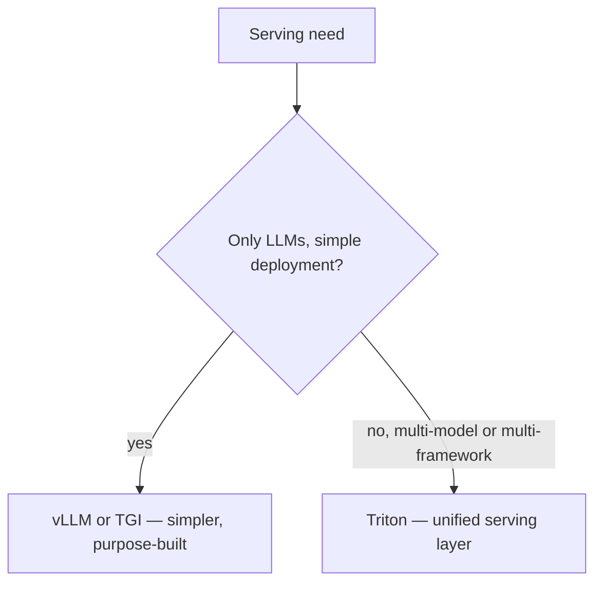

vLLM and TGI are purpose-built for LLM serving specifically. Triton takes a different scope — a general-purpose, multi-framework inference server that can serve LLMs alongside traditional ML models (the embedding models and classifiers from earlier in this roadmap) in one unified platform.

## Why Multi-Framework Serving Matters

A real production AI system rarely runs only LLMs — the embedding models from March's RAG series, a classification model for routing (April's cost-aware agent design), and an LLM all typically need to be served together. Triton's model repository can host all of them behind one consistent serving layer:

```
model_repository/
├── llm_generator/
│   └── config.pbtxt
├── embedding_model/
│   └── config.pbtxt
└── intent_classifier/
    └── config.pbtxt
```

## Configuring a Model for Serving

```protobuf
name: "llm_generator"
backend: "vllm"
max_batch_size: 32
instance_group [{ count: 1, kind: KIND_GPU }]
dynamic_batching { max_queue_delay_microseconds: 100 }
```

Triton's `vllm` backend means you get vLLM's continuous batching and PagedAttention *within* Triton's serving framework — not a competing choice to vLLM, but a way to run vLLM-backed LLM serving alongside other model types in one operational surface.

## Model Ensembles: Composing Multiple Models in One Request

```protobuf
name: "rag_pipeline_ensemble"
platform: "ensemble"
ensemble_scheduling {
  step [
    { model_name: "embedding_model", input_map { key: "text" value: "query" } },
    { model_name: "llm_generator", input_map { key: "context" value: "retrieved_docs" } }
  ]
}
```

This lets you define a multi-step pipeline — embed a query, retrieve, generate — as a single served "ensemble," with Triton handling the orchestration between steps server-side rather than requiring a separate application-layer orchestration service for what's fundamentally a fixed pipeline.

## When Triton's Complexity Is Worth It



Triton's operational complexity — more configuration surface, a steeper learning curve — is worth it specifically when you're serving a genuine mix of model types and frameworks at scale, with a platform team that benefits from one consistent serving and monitoring surface across all of them. For a team serving only LLMs, vLLM or TGI's simpler, more purpose-built approach is usually the better starting point.

## Enterprise and Regulated-Industry Fit

Triton's maturity as an NVIDIA-maintained, enterprise-support-backed product (versus the more community-driven vLLM/TGI projects) makes it a common default in regulated industries or large enterprises with existing NVIDIA infrastructure investments and support contract requirements — a real, non-technical factor in the choice worth acknowledging alongside the pure technical comparison.

## Monitoring and Metrics

Triton exposes detailed per-model metrics (queue time, compute time, GPU utilization per model) through its own metrics endpoint, feeding the same dashboard infrastructure from June's series — with the added dimension of per-model breakdown that matters specifically when several models share one serving deployment.

---

*Part of the [AI Infrastructure series]({{ site.baseurl }}/tags/ai-infra-series/) — next: [choosing GPUs for LLM inference]({{ site.baseurl }}/posts/choosing-gpus-llm-inference/), the hardware decision underlying every server covered so far.*
