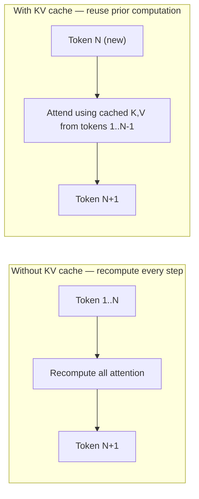

The KV cache has come up in nearly every post this week without a full explanation. It's the single most important concept for understanding why LLM inference behaves the way it does — memory-hungry, and much faster on the second token than intuition about "generating text" would suggest.

## Why Generation Would Be Slow Without It

An LLM predicts the next token by attending over every previous token in the sequence. Naively, generating token N+1 would require recomputing attention over all N previous tokens from scratch — for a 1000-token generation, that's redundant computation on tokens 1 through 999 repeated at every single step.



## What Gets Cached

For each layer, the Key and Value projections (the "K" and "V" in attention) computed for every previous token are stored, so generating the next token only requires computing attention for the *new* token against the cached K/V from everything before it — not recomputing everything from scratch.

```python
class KVCache:
    def __init__(self, num_layers: int, max_seq_len: int, num_heads: int, head_dim: int):
        self.keys = torch.zeros(num_layers, max_seq_len, num_heads, head_dim)
        self.values = torch.zeros(num_layers, max_seq_len, num_heads, head_dim)
        self.current_len = 0

    def append(self, layer: int, new_key, new_value):
        self.keys[layer, self.current_len] = new_key
        self.values[layer, self.current_len] = new_value
```

## The Cost: Memory, Not Compute

The KV cache trades compute for memory — instead of recomputing, you store, and that storage grows linearly with sequence length and batch size, which is exactly the memory pressure PagedAttention (from Sunday's vLLM post) was designed to manage efficiently.

```python
def kv_cache_size_per_request(num_layers: int, hidden_dim: int, seq_len: int, precision_bytes: int = 2) -> float:
    return (2 * num_layers * hidden_dim * seq_len * precision_bytes) / 1e9  # GB
```

For a model with many layers and a large hidden dimension, generating a long response for many concurrent users can mean the KV cache alone consumes more GPU memory than the model weights themselves.

## Prefill vs Decode: Two Different Phases

```python
phases = {
    "prefill": "processing the full input prompt at once — compute-bound, fills the KV cache initially",
    "decode": "generating one token at a time — memory-bandwidth-bound, reads the KV cache repeatedly",
}
```

This distinction matters practically: a long input prompt with a short generated response is prefill-heavy (compute-bound); a short prompt with a long generated response is decode-heavy (memory-bandwidth-bound). Different workloads stress different parts of the hardware, which is why the same GPU can behave very differently on a summarization task (long input, short output) versus a creative writing task (short input, long output).

## Prompt Caching: Reusing the KV Cache Across Requests

The prompt caching technique from the LLM engineering series — caching a long, repeated system prompt or context — is precisely a KV cache reuse optimization at the application level: if the same prefix appears across multiple requests, its KV cache can be computed once and reused, skipping prefill entirely for that shared portion.

```python
def benefits_from_prompt_caching(requests: list[dict]) -> bool:
    common_prefixes = find_common_prefixes([r["prompt"] for r in requests])
    return any(len(prefix) > 1000 for prefix in common_prefixes)  # worth caching if substantial and shared
```

## Why This Explains Earlier Cost Optimization Advice

Every piece of prompt-caching cost-optimization advice from the LLM engineering series traces directly back to this mechanism — a cached prefix means skipped prefill compute and reused KV cache entries, which is why structuring prompts with stable content first and variable content last (maximizing the cacheable prefix) has real, measurable cost impact.

---

*Part of the [AI Infrastructure series]({{ site.baseurl }}/tags/ai-infra-series/) — next: [dynamic batching strategies]({{ site.baseurl }}/posts/dynamic-batching-strategies-llm-serving/), building directly on this week's batching and caching foundations.*
