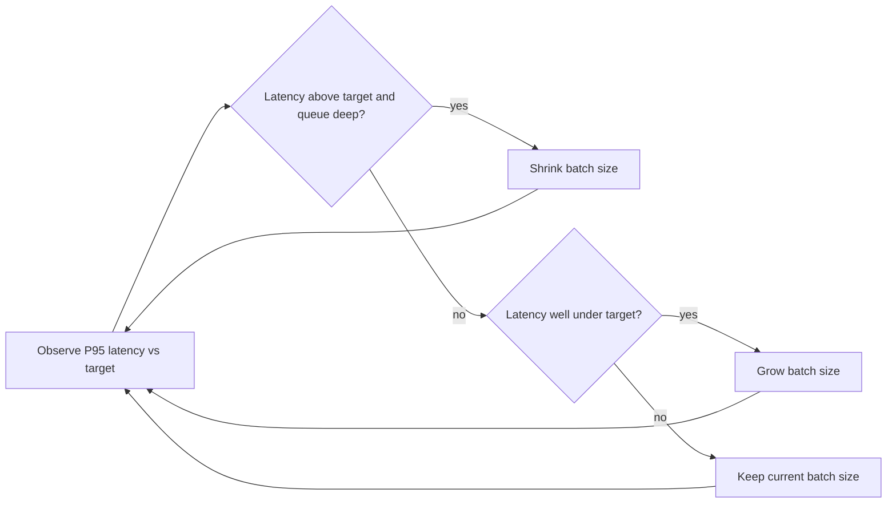

Continuous batching (Sunday's vLLM post) solved the core scheduling problem. This post covers the tuning layer on top of it — the specific parameters that determine how a real deployment balances throughput against latency for your actual traffic pattern.



Adjusting batch size dynamically based on observed P95 latency, rather than a fixed static configuration, is what lets one deployment automatically trade throughput for latency as load varies through the day — the loop in this diagram runs continuously against live metrics.

## The Key Tuning Parameters

```python
batching_config = {
    "max_num_seqs": 256,              # max concurrent requests in a batch
    "max_num_batched_tokens": 8192,   # total token budget across the batch per step
    "max_queue_delay_microseconds": 100,  # how long to wait for more requests before starting
}
```

`max_num_batched_tokens`, not just `max_num_seqs`, is often the binding constraint in practice — a batch of 256 very short requests behaves very differently from a batch of 256 requests each with a long context, and the token budget caps GPU memory pressure directly.

## Latency-Optimized vs Throughput-Optimized Configurations

```python
latency_optimized = {"max_num_seqs": 32, "max_queue_delay_microseconds": 10}   # small batches, minimal wait
throughput_optimized = {"max_num_seqs": 512, "max_queue_delay_microseconds": 500}  # large batches, willing to wait
```

An interactive chat feature (users watching a streaming response) wants the latency-optimized configuration — smaller batches, minimal queuing delay, even at some throughput cost. A batch document-processing pipeline (this month's earlier posts) wants the throughput-optimized configuration — maximize total tokens/second, and per-request latency barely matters since nobody's watching in real time.

## Priority-Based Scheduling

Not every request deserves equal priority. A production system serving both interactive and batch traffic benefits from explicit priority scheduling:

```python
class PriorityScheduler:
    def __init__(self):
        self.interactive_queue = []
        self.batch_queue = []

    def add_request(self, request, priority: str = "batch"):
        (self.interactive_queue if priority == "interactive" else self.batch_queue).append(request)

    def next_batch(self, capacity: int) -> list:
        batch = self.interactive_queue[:capacity]  # interactive always fills first
        remaining = capacity - len(batch)
        if remaining > 0:
            batch += self.batch_queue[:remaining]
        return batch
```

This ensures a burst of batch traffic never starves interactive users of GPU capacity — directly relevant to any deployment serving both the real-time voice/agent workloads from earlier in this roadmap and offline batch processing from the same infrastructure.

## Adaptive Batching Based on Load

```python
def adaptive_batch_size(current_queue_depth: int, current_p95_latency: float, latency_target: float) -> int:
    if current_p95_latency > latency_target and current_queue_depth > 10:
        return max(16, current_batch_size - 32)  # shrink batches to reduce latency
    elif current_p95_latency < latency_target * 0.7:
        return min(512, current_batch_size + 32)  # grow batches to use spare capacity
    return current_batch_size
```

Adjusting batch parameters dynamically based on observed latency (from June's P95 monitoring) rather than a fixed static configuration lets a deployment automatically trade throughput for latency as load varies throughout the day, without manual intervention.

## Measuring the Right Things

```python
def batching_health_metrics(server_stats: dict) -> dict:
    return {
        "avg_batch_size": server_stats["total_requests_processed"] / server_stats["total_batches"],
        "gpu_utilization": server_stats["gpu_busy_time"] / server_stats["total_time"],
        "queue_wait_p95": server_stats["queue_wait_times_p95"],
    }
```

Average batch size and GPU utilization together tell you whether your batching configuration is actually using available capacity — low GPU utilization with a low average batch size usually means requests aren't arriving fast enough to fill batches, a traffic-pattern problem no batching tuning alone can fix.

## Testing Batching Configuration Changes Safely

Apply the canary rollout discipline from June's evaluation series to infrastructure configuration changes, not just prompt or model changes — a batching parameter change that looks good in a load test can behave differently under real production traffic patterns, and a small-percentage rollout with latency/throughput guardrails catches that before it affects all traffic.

---

*Part of the [AI Infrastructure series]({{ site.baseurl }}/tags/ai-infra-series/) — next: [load balancing across multiple backends]({{ site.baseurl }}/posts/load-balancing-llm-traffic-backends/), scaling beyond what one server can handle.*
