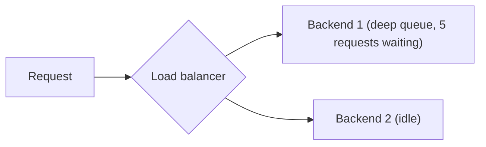

One inference server, however well-tuned, has a throughput ceiling. Scaling beyond it means running multiple server instances behind a load balancer — and LLM traffic has specific characteristics that make naive round-robin load balancing a poor fit.

## Why Round-Robin Isn't Enough



Round-robin distributes requests evenly by *count*, blind to each backend's actual current load — and LLM request duration varies enormously (a short classification call versus a long generation), so equal request counts don't mean equal load. A backend with a deep queue keeps getting new requests under round-robin, compounding the imbalance.

## Least-Outstanding-Requests Routing

```python
class LeastLoadedBalancer:
    def __init__(self, backends: list[str]):
        self.backends = backends
        self.outstanding = {b: 0 for b in backends}

    def route(self) -> str:
        return min(self.outstanding, key=self.outstanding.get)

    def on_request_start(self, backend: str):
        self.outstanding[backend] += 1

    def on_request_complete(self, backend: str):
        self.outstanding[backend] -= 1
```

Routing to whichever backend currently has the fewest outstanding requests adapts automatically to varying request durations — a backend stuck processing several long generations naturally receives fewer new requests until it catches up, without needing to predict request duration in advance.

## Latency-Aware Routing

```python
class LatencyAwareBalancer:
    def __init__(self, backends: list[str]):
        self.backends = backends
        self.recent_latencies = {b: deque(maxlen=20) for b in backends}

    def route(self) -> str:
        avg_latencies = {b: mean(lats) if lats else 0 for b, lats in self.recent_latencies.items()}
        return min(avg_latencies, key=avg_latencies.get)
```

A more sophisticated variant that routes based on recent observed latency per backend — useful when backends have heterogeneous hardware (mixing GPU generations after a partial upgrade) where request count or queue depth alone don't capture real capacity differences.

## Health Checking and Automatic Failover

```python
async def health_check_loop(backends: list[str], interval_s: float = 5):
    while True:
        for backend in backends:
            healthy = await check_backend_health(backend)
            update_backend_status(backend, healthy)
        await asyncio.sleep(interval_s)

def route_with_failover(balancer, backend_status: dict) -> str:
    healthy_backends = [b for b in balancer.backends if backend_status[b]]
    if not healthy_backends:
        raise NoHealthyBackends()
    return balancer.route_among(healthy_backends)
```

Routing only among currently-healthy backends, with continuous health checking, is what makes a single backend failure a non-event rather than an outage — directly connecting to the fallback-strategies post later this month, at the infrastructure layer rather than the provider layer.

## Sticky Sessions for Stateful Workloads

For workloads relying on server-side session state (a conversation with cached context, or the LangGraph checkpoint state from April's post if it's held in server memory rather than externalized), route the same session consistently to the same backend:

```python
def sticky_route(session_id: str, backends: list[str]) -> str:
    return backends[hash(session_id) % len(backends)]
```

Prefer externalizing session state (to Redis or a database) over relying on sticky routing where possible — sticky sessions create an availability dependency on one specific backend instance, undermining the failover benefit above.

## Load Balancer Placement in the Stack

For most deployments, a dedicated load balancer (nginx, Envoy, or a cloud load balancer) sits in front of the inference servers, with the routing logic above implemented either in the load balancer's configuration or in a thin application-layer proxy — Kubernetes' own service load balancing (covered in the autoscaling post) handles the basic case, with custom routing logic layered on top for LLM-specific needs like the above.

---

*Part of the [AI Infrastructure series]({{ site.baseurl }}/tags/ai-infra-series/) — next: [semantic caching]({{ site.baseurl }}/posts/semantic-caching-llm-apis/), reducing load before it ever reaches a backend at all.*
