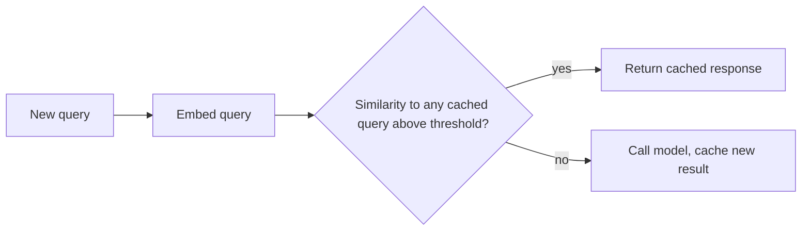

Every technique this week has been about serving requests more efficiently. The cheapest request is one that never reaches the model at all — caching, done well, does exactly that for a meaningful fraction of real traffic.

## Exact-Match Caching: The Simple Case

```python
def exact_cache_lookup(prompt: str) -> str | None:
    cache_key = hashlib.sha256(prompt.encode()).hexdigest()
    return cache.get(cache_key)

def cached_generate(prompt: str) -> str:
    cached = exact_cache_lookup(prompt)
    if cached:
        return cached
    result = model.generate(prompt)
    cache.set(hashlib.sha256(prompt.encode()).hexdigest(), result, ttl=3600)
    return result
```

Exact-match caching only helps when the identical prompt recurs verbatim — useful for genuinely repeated queries (a FAQ-style feature, a common tool-call argument combination) but misses the much larger set of *semantically* similar-but-not-identical requests.

## Semantic Caching: Matching on Meaning



```python
def semantic_cache_lookup(query: str, similarity_threshold: float = 0.95) -> str | None:
    query_embedding = embed(query)
    hits = cache_vector_store.search(query_embedding, top_k=1)
    if hits and hits[0].score > similarity_threshold:
        return hits[0].payload["response"]
    return None

def semantic_cached_generate(query: str) -> str:
    cached = semantic_cache_lookup(query)
    if cached:
        return cached
    result = model.generate(query)
    cache_vector_store.upsert(id=uuid4(), vector=embed(query), payload={"query": query, "response": result})
    return result
```

"What's your refund policy?" and "How do refunds work?" are different strings but nearly identical in meaning — semantic caching catches this overlap that exact-match caching structurally can't, at the cost of needing an embedding call on every lookup and careful threshold tuning.

## The Threshold Tradeoff

```python
def evaluate_cache_threshold(threshold: float, test_pairs: list[dict]) -> dict:
    results = [semantic_cache_lookup(p["query"], threshold) == p["expected_cache_hit"] for p in test_pairs]
    return {"accuracy": mean(results), "threshold": threshold}
```

Too low a threshold serves a cached response for queries that are similar but *meaningfully different* — a serious correctness risk, not just a minor quality issue, if the cached answer is factually wrong for the new query's actual intent. Too high a threshold rarely hits, undermining the whole point. Tune this against a labeled test set of query pairs, treating it as a real evaluation problem, not a single default value trusted blindly.

## What Should and Shouldn't Be Cached

```python
def is_cacheable(request: dict) -> bool:
    return (
        not request.get("contains_user_specific_data")  # never cache personalized responses across users
        and not request.get("requires_current_information")  # stale cache for time-sensitive queries is a real bug
        and request.get("temperature", 1.0) < 0.3  # high-temperature requests are meant to vary, don't cache them
    )
```

Caching a response containing another user's personal data, or caching a "what's the current status" query past its freshness window, are both correctness bugs disguised as an optimization — cacheability needs to be an explicit, deliberate classification per request type, not a blanket default.

## Cache Invalidation for Changing Facts

For cached responses grounded in retrieved context (the RAG patterns from March), invalidate cache entries when the underlying source document changes — a semantic cache with no invalidation strategy will confidently serve stale, wrong answers indefinitely after a knowledge base update.

```python
def invalidate_cache_for_document(doc_id: str):
    affected_entries = cache_vector_store.search_by_metadata({"source_doc_id": doc_id})
    for entry in affected_entries:
        cache_vector_store.delete(entry.id)
```

## Measuring Cache Effectiveness

Track hit rate, but also track the cost/latency saved per hit and — critically — the false-positive rate (cases where a cache hit served a subtly wrong response for the actual query) through periodic sampling and human review, the same evaluation discipline from June applied specifically to the caching layer's correctness.

---

*Part of the [AI Infrastructure series]({{ site.baseurl }}/tags/ai-infra-series/) — next: [rate limiting and backpressure]({{ site.baseurl }}/posts/rate-limiting-backpressure-llm-endpoints/), protecting the system when caching and batching still aren't enough.*
