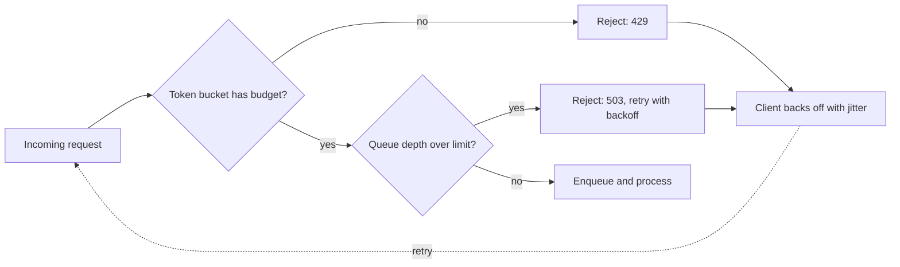

Batching, caching, and load balancing all help a system handle more traffic efficiently. None of them protect the system when demand genuinely exceeds capacity — that's what rate limiting and backpressure are for, and getting them wrong means either an outage or a terrible user experience during exactly the moments that matter most.



Rate limiting on token budget (not raw request count) and backpressure via an explicit 503 are the two layers that keep a system predictable under genuine overload — the jittered client retry loop closing the diagram is what prevents a wave of synchronized retries from re-triggering the same overload.

## Token Bucket Rate Limiting

```python
class TokenBucket:
    def __init__(self, capacity: int, refill_rate_per_sec: float):
        self.capacity = capacity
        self.tokens = capacity
        self.refill_rate = refill_rate_per_sec
        self.last_refill = time.monotonic()

    def try_consume(self, tokens: int = 1) -> bool:
        now = time.monotonic()
        self.tokens = min(self.capacity, self.tokens + (now - self.last_refill) * self.refill_rate)
        self.last_refill = now
        if self.tokens >= tokens:
            self.tokens -= tokens
            return True
        return False
```

Token bucket allows brief bursts above the average rate while still enforcing a long-run limit — better suited to real usage patterns than a strict fixed-window limit, which can reject legitimate bursty traffic even when average load is well within capacity.

## Rate Limiting by Actual Cost, Not Just Request Count

For LLM APIs specifically, a naive "N requests per minute" limit is a poor proxy for actual load — one request can cost 10x another depending on prompt length and generation length. Rate limit on token budget instead:

```python
class TokenBudgetLimiter:
    def __init__(self, tokens_per_minute: int):
        self.bucket = TokenBucket(capacity=tokens_per_minute, refill_rate_per_sec=tokens_per_minute / 60)

    def check_and_consume(self, estimated_tokens: int) -> bool:
        return self.bucket.try_consume(estimated_tokens)
```

This connects directly to April's cost-aware agent design and June's cost-monitoring posts — rate limiting on token budget is the request-admission-layer enforcement of the same budget concept those posts covered at the application and observability layers.

## Backpressure: Signaling Overload Instead of Silently Degrading

```python
async def handle_request_with_backpressure(request, queue: asyncio.Queue, max_queue_depth: int = 100):
    if queue.qsize() >= max_queue_depth:
        raise HTTPException(503, "Service temporarily overloaded, please retry with backoff")
    await queue.put(request)
```

Returning an explicit 503 with a retry signal when genuinely overloaded is better than accepting every request and letting latency silently balloon for everyone — clients that respect the signal (with proper retry-with-backoff logic) get a much better overall experience than a system that accepts unlimited queued work and degrades unpredictably.

## Client-Side Retry with Exponential Backoff

```python
async def call_with_backoff(request_fn, max_retries: int = 4) -> dict:
    for attempt in range(max_retries):
        try:
            return await request_fn()
        except RateLimitError:
            wait = (2 ** attempt) + random.uniform(0, 1)  # jitter avoids synchronized retry storms
            await asyncio.sleep(wait)
    raise MaxRetriesExceeded()
```

The random jitter matters — without it, many clients rate-limited at the same moment retry in lockstep, creating a synchronized retry storm that re-triggers the same overload condition repeatedly.

## Tiered Rate Limits by User/Feature Priority

```python
rate_limit_tiers = {
    "internal_critical": {"tokens_per_minute": 1_000_000, "priority": "highest"},
    "paid_tier": {"tokens_per_minute": 100_000, "priority": "high"},
    "free_tier": {"tokens_per_minute": 10_000, "priority": "low"},
}
```

Under genuine capacity pressure, shedding low-priority traffic first (rather than degrading uniformly across all users) preserves the experience for your highest-value or most critical traffic — directly connecting to April's cost-aware routing, now applied as an admission-control policy rather than a per-request routing decision.

## Testing Rate Limiting Under Real Load

Load-test rate limiting and backpressure logic explicitly, including the retry-storm scenario, before trusting it in production — the same discipline as any other infrastructure component from this week, verified under realistic concurrent load rather than assumed correct from code review alone.

---

*Part of the [AI Infrastructure series]({{ site.baseurl }}/tags/ai-infra-series/) — next: [autoscaling GPU workloads in Kubernetes]({{ site.baseurl }}/posts/autoscaling-gpu-workloads-kubernetes/), scaling capacity itself rather than just managing demand against fixed capacity.*
