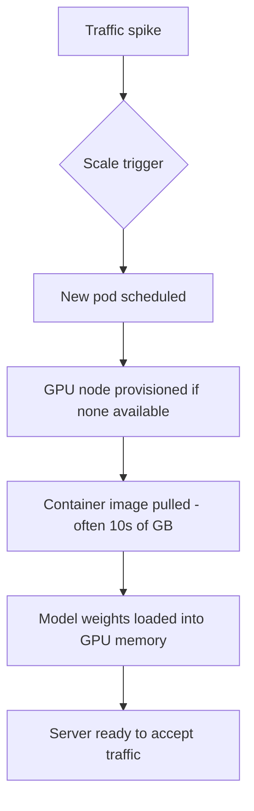

Rate limiting and backpressure manage demand against fixed capacity. Autoscaling changes capacity itself in response to demand — genuinely harder for GPU workloads than typical CPU-based services, for reasons worth understanding before assuming standard Kubernetes autoscaling just works.

## Why GPU Autoscaling Is Harder Than CPU Autoscaling



Every step in that chain takes real time — GPU nodes are more expensive and often slower to provision than CPU nodes, container images for inference servers are large, and loading multi-gigabyte model weights into GPU memory can itself take minutes. A CPU service might scale up in seconds; a GPU inference service scaling from zero can take several minutes, which matters enormously for how you design the autoscaling policy.

## Horizontal Pod Autoscaler on Custom Metrics

```yaml
apiVersion: autoscaling/v2
kind: HorizontalPodAutoscaler
metadata:
  name: inference-server-hpa
spec:
  scaleTargetRef:
    apiVersion: apps/v1
    kind: Deployment
    name: vllm-inference-server
  minReplicas: 2
  maxReplicas: 20
  metrics:
    - type: Pods
      pods:
        metric:
          name: inference_queue_depth
        target:
          type: AverageValue
          averageValue: "10"
```

Scaling on GPU utilization alone is a weaker signal than it sounds — a GPU can show high utilization while still having queue depth headroom, or low utilization due to a batching configuration bottleneck rather than genuine spare capacity. Queue depth or request latency are generally better-correlated scaling triggers for LLM serving specifically.

## Mitigating Slow Scale-Up with Pre-Warming

```python
def predictive_prewarm(historical_traffic: list[dict], current_time: datetime) -> int:
    typical_load_at_this_time = get_historical_average(historical_traffic, current_time)
    return calculate_needed_replicas(typical_load_at_this_time, buffer_factor=1.2)
```

For predictable daily/weekly traffic patterns, scheduled pre-warming (scaling up ahead of known peak periods rather than reactively) sidesteps the slow-scale-up problem entirely for the traffic you can anticipate — reactive autoscaling then only needs to handle genuine surprises.

## Never Scale to Zero for Latency-Sensitive Workloads

```python
min_replicas_policy = {
    "interactive_chat_service": 2,   # never zero — cold start is unacceptable for user-facing latency
    "batch_processing_service": 0,   # fine to scale to zero — a few minutes of cold start is acceptable
}
```

The scale-to-zero pattern common for stateless CPU services is usually wrong for latency-sensitive GPU inference — keep a warm minimum replica count for anything user-facing, and reserve scale-to-zero for genuinely latency-tolerant batch workloads where cold-start time doesn't matter.

## GPU Node Pool Configuration

```yaml
# Cluster autoscaler node pool config, conceptually
node_pools:
  - name: gpu-inference-pool
    instance_type: g5.xlarge
    min_nodes: 1
    max_nodes: 10
    scale_down_delay: 15m  # avoid thrashing — don't tear down a node moments after provisioning it
```

`scale_down_delay` matters specifically for GPU nodes given their slow provisioning time — scaling a node down too eagerly after a brief traffic dip, only to need to provision a new one minutes later, wastes both the provisioning time cost and real money on repeated cold starts.

## Monitoring Autoscaling Behavior

Track scale-up latency (time from trigger to serving-ready) and scale-down frequency as first-class metrics in the June observability dashboard — a system that's constantly scaling up and down (thrashing) usually indicates the trigger metric or cooldown period needs tuning, not that autoscaling itself is broken.

---

*Part of the [AI Infrastructure series]({{ site.baseurl }}/tags/ai-infra-series/) — next: [multi-region deployment]({{ site.baseurl }}/posts/multi-region-deployment-low-latency-ai/) for applications serving users across geographies.*
