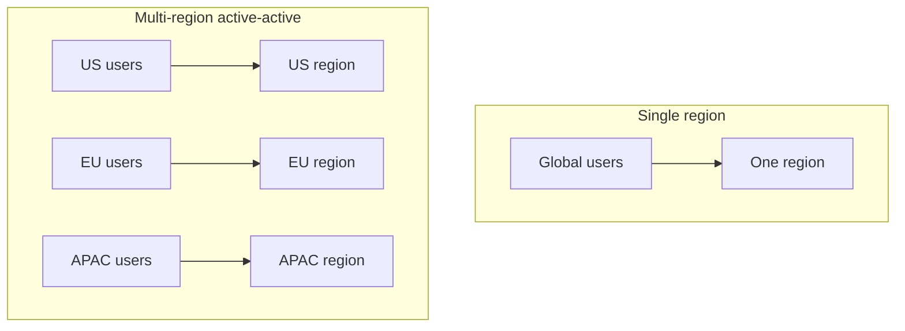

Every optimization this month has assumed one deployment region. A global user base adds a new latency source — network round-trip distance — that no amount of batching or caching tuning within a single region can fix.

## Why Region Matters for Perceived Latency

The June latency-budget post established that P95/P99 matter more than average latency. Cross-continental network round-trip alone can add 100-200ms before a request even reaches the model — for a voice agent (July's series) with a sub-second total latency budget, that's a meaningful fraction consumed purely by geography, before any inference happens at all.

## Deployment Topology Options



**Active-active**: fully independent deployments in each region, each serving local traffic, with data replicated or regionally isolated depending on compliance needs. Best latency, most operational complexity.

**Single region with edge caching**: keep the model serving centralized, but cache/serve static or semi-static content (from August's caching post) at the edge, closer to users. Simpler, but doesn't help latency-sensitive generation itself.

## Routing Users to Their Nearest Region

```python
def route_to_nearest_region(client_ip: str) -> str:
    user_location = geolocate(client_ip)
    region_latencies = {region: estimate_latency(user_location, region) for region in AVAILABLE_REGIONS}
    return min(region_latencies, key=region_latencies.get)
```

DNS-based geo-routing (most cloud providers offer this natively) or an application-layer routing decision both work — the DNS approach is simpler and doesn't add an extra request hop, generally the better default unless you need routing logic more sophisticated than pure geography (accounting for a region being at capacity, say).

## Data Residency and Model Availability Complications

Multi-region deployment isn't purely a latency optimization — it intersects directly with the compliance considerations from September's security series (GDPR, data residency requirements) and with practical constraints like model availability varying by cloud region or provider. Plan region selection around both latency *and* compliance requirements together, not latency alone.

## Keeping Regions in Sync

```python
def deploy_model_update_multi_region(new_model_version: str, regions: list[str]):
    for region in regions:
        deploy_to_region(new_model_version, region, canary_first=True)  # August's canary pattern, per region
    verify_consistency_across_regions(regions)
```

Apply the canary rollout discipline from June/August per-region rather than globally simultaneously — a bad model update caught in one region's canary before it reaches every region limits blast radius the same way a single-region canary limits blast radius within that region.

## Cost Implications

Multi-region deployment multiplies infrastructure cost roughly by region count for active-active topologies — the GPU sizing decisions from earlier this week now apply per region, and idle capacity in a low-traffic region during off-peak local hours is a real cost to account for in the capacity planning covered later this month.

## When Multi-Region Isn't Worth It Yet

For an application with a geographically concentrated user base, or one where generation latency (seconds) dwarfs network latency (tens to hundreds of milliseconds) anyway, single-region deployment with good caching is usually the right starting point — multi-region earns its substantial operational complexity specifically once network latency becomes a meaningful fraction of your total latency budget, which the June per-stage latency breakdown will tell you directly.

---

*Part of the [AI Infrastructure series]({{ site.baseurl }}/tags/ai-infra-series/) — next: [blue-green and canary deployments for model updates]({{ site.baseurl }}/posts/blue-green-canary-model-updates/), the rollout mechanics referenced above in full depth.*
