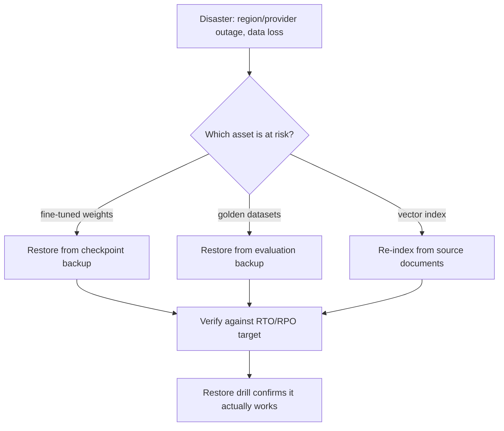

Every pattern this week helps with routine failures — a bad deploy, a traffic spike, a single backend going unhealthy. Disaster recovery plans for the larger failures: a full region outage, a provider-wide incident, data loss — the scenarios where the mitigations covered so far aren't enough on their own.



Each AI-specific asset class needs its own backup and restore path, and each is checked against an explicit RTO/RPO target set per service rather than assumed uniform — the restore-drill step matters because a backup that's never been tested for restoration isn't a reliable one.

## Defining RTO and RPO for AI Services

```python
disaster_recovery_targets = {
    "interactive_chat_feature": {"rto_minutes": 15, "rpo_minutes": 0},   # near-zero data loss tolerance, fast recovery needed
    "batch_document_pipeline": {"rto_minutes": 240, "rpo_minutes": 60},  # tolerates longer recovery and some data loss
    "fine_tuned_model_artifacts": {"rto_minutes": 60, "rpo_minutes": 1440},  # daily backup acceptable
}
```

RTO (Recovery Time Objective — how long until service is restored) and RPO (Recovery Point Objective — how much data loss is acceptable) should be set explicitly per service, not assumed uniformly — a batch pipeline and an interactive chat feature have very different acceptable downtime, and treating them identically wastes effort on the less critical one or under-protects the more critical one.

## What's Actually at Risk for AI Services Specifically

Beyond standard infrastructure disaster recovery concerns, AI services have distinctive assets worth explicit protection:

```python
critical_ai_assets = {
    "fine_tuned_model_weights": "back up adapter checkpoints (May's series) — retraining from scratch is expensive and slow",
    "golden_datasets": "back up evaluation golden sets (June's series) — losing these erases your quality baseline",
    "vector_store_indexes": "back up or ensure re-indexable from source documents",
    "prompt_version_history": "back up prompt configuration and version history (Langfuse/LangSmith data from June)",
}
```

Losing a fine-tuned model's weights without a backup means a full retraining run, at the full cost from May's economics post — meaningfully more disruptive than losing a stateless service's runtime state, which just needs a redeploy.

## Provider-Level Outage Planning

```python
def multi_provider_fallback_config() -> dict:
    return {
        "primary": "anthropic",
        "secondary": "openai",
        "tertiary": "self_hosted_vllm",  # last resort, lower capability but always available
    }
```

Tomorrow's post covers fallback strategies for provider outages in depth — worth flagging here as a disaster-recovery-specific consideration: a full provider outage is a real, if infrequent, event, and a documented fallback plan (not just aspirational awareness that it "should" work) is what makes the difference during an actual incident.

## Backup and Restore Testing

```python
def test_restore_procedure(backup_id: str) -> dict:
    restored_env = spin_up_test_environment_from_backup(backup_id)
    verification_results = run_smoke_tests(restored_env)
    teardown_test_environment(restored_env)
    return verification_results
```

A backup that's never been tested for restoration is not a reliable backup — schedule periodic restore drills (quarterly is a common cadence) that actually restore from backup into a test environment and verify functionality, not just confirm the backup file exists.

## Runbooks for AI-Specific Incident Types

Extend the incident postmortem template from June with pre-written runbooks for AI-specific disaster scenarios: provider outage, fine-tuned model corruption, vector index corruption or data loss, and a bad model update that passed canary but failed at full scale. Each runbook should specify the exact recovery steps, who owns execution, and the RTO/RPO target it's designed to meet.

## Communicating During an AI Service Incident

Unlike a typical service outage, an AI service degradation can be subtle — not fully down, but producing lower-quality or unsafe output. Incident communication plans should explicitly cover this "degraded but not down" case, including a clear decision authority for when to proactively disable a feature versus let it run in a degraded state while investigating, echoing the guardrail fail-closed principle from March applied at the organizational response level.

## Testing the Full Plan, Not Just Components

A full disaster recovery test — simulating a real region outage or provider outage end to end, including the human response process, not just the technical failover — is the only way to validate that RTO/RPO targets are actually achievable in practice, not just on paper.

---

*Part of the [AI Infrastructure series]({{ site.baseurl }}/tags/ai-infra-series/) — next: [model routing]({{ site.baseurl }}/posts/model-routing-sending-requests-right-model/), a capability disaster recovery depends on directly.*
