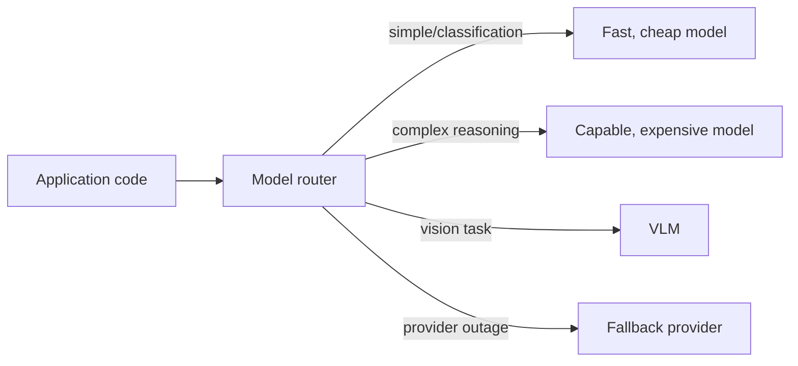

April's cost-aware agent design and June's provider comparison both touched on routing simpler requests to cheaper models. This post covers building that as proper infrastructure — a routing layer every application-level call goes through, rather than ad hoc per-feature logic.

## Why a Dedicated Routing Layer



Without a centralized router, every feature team hardcodes its own model choice, duplicating routing logic and making a later model swap or cost optimization require changes across many separate codebases — a dedicated router centralizes that decision once.

## A Rule-Based Router

```python
class ModelRouter:
    def __init__(self, rules: list[dict]):
        self.rules = rules  # ordered, first match wins

    def route(self, request: dict) -> str:
        for rule in self.rules:
            if rule["condition"](request):
                return rule["model"]
        return self.rules[-1]["model"]  # default fallback

router = ModelRouter([
    {"condition": lambda r: r["task_type"] == "classification", "model": "claude-haiku-4-5"},
    {"condition": lambda r: r.get("has_image"), "model": "claude-sonnet-5"},
    {"condition": lambda r: r["estimated_complexity"] == "high", "model": "claude-opus-5"},
    {"condition": lambda r: True, "model": "claude-sonnet-5"},  # default
])
```

## Complexity-Based Routing

```python
def estimate_request_complexity(request: dict) -> str:
    response = classify_llm.chat([{
        "role": "user",
        "content": f"Classify this request's complexity as low/medium/high: {request['prompt'][:500]}"
    }], temperature=0)
    return response.content.strip().lower()
```

Using a cheap, fast model to classify complexity before routing the actual request is a small added cost that pays for itself when it correctly routes the majority-simple traffic away from an expensive model — the same model-routing pattern from April's cost-aware agent post, now generalized as shared infrastructure.

## Confidence-Based Escalation

```python
def route_with_escalation(request: dict, cheap_model_result: dict) -> dict:
    if cheap_model_result["confidence"] < ESCALATION_THRESHOLD:
        return capable_model.generate(request)  # escalate to a stronger model
    return cheap_model_result
```

Rather than deciding complexity upfront, this pattern tries the cheap model first and escalates only when its own confidence is low — avoiding the cost of a separate classification call, at the cost of sometimes paying for two model calls (cheap, then escalated) on the hard cases.

## Provider-Aware Routing for Resilience

```python
def route_with_provider_fallback(request: dict, primary_provider: str, fallback_providers: list[str]) -> dict:
    for provider in [primary_provider] + fallback_providers:
        try:
            return call_provider(provider, request)
        except ProviderUnavailable:
            continue
    raise AllProvidersUnavailable()
```

This is where model routing and yesterday's disaster recovery planning intersect directly — a router that already handles multi-model routing is a natural place to also implement multi-provider fallback, covered in full tomorrow.

## Monitoring Router Decisions

```python
def log_routing_decision(request: dict, chosen_model: str, reason: str):
    routing_log.record({"request_id": request["id"], "model": chosen_model, "reason": reason, "timestamp": now()})
```

Logging *why* each routing decision was made (not just which model was chosen) is essential for debugging misrouted requests and for periodically auditing whether the routing rules still match actual traffic patterns and cost/quality tradeoffs, following the same continuous-evaluation discipline from June.

## Evaluating a Router's Effectiveness

Apply June's cost-quality comparison methodology directly to the router as a whole — measure aggregate cost and quality across all routed traffic against a baseline of "always use the most capable model," confirming the router genuinely improves the cost-quality tradeoff rather than just adding complexity without measurable benefit.

---

*Part of the [AI Infrastructure series]({{ site.baseurl }}/tags/ai-infra-series/) — next: [fallback strategies when a model provider goes down]({{ site.baseurl }}/posts/fallback-strategies-provider-outage/), building directly on this router.*
