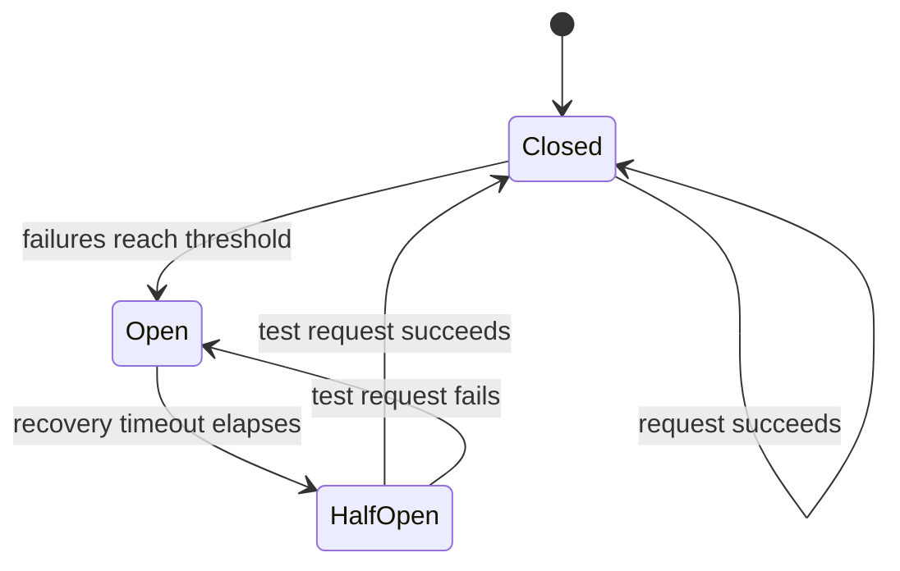

Yesterday's router mentioned provider fallback in passing. Every application built on a managed LLM API throughout this roadmap has an implicit dependency on that provider's uptime — this post covers making that dependency's failure mode a managed, tested one rather than an unplanned outage.



The circuit breaker's `half_open` state is what makes fallback self-healing — after the recovery timeout, exactly one test request is allowed through, and only fully closing on success avoids a thundering-herd retry storm the moment a struggling provider starts recovering.

## Detecting a Provider Outage vs a Transient Error

```python
def classify_error(error: Exception) -> str:
    if isinstance(error, RateLimitError):
        return "transient_retry"  # back off and retry the same provider
    if isinstance(error, (ConnectionError, TimeoutError)) and recent_error_rate("primary") > 0.5:
        return "provider_outage"  # sustained failures — switch providers
    return "transient_retry"
```

Distinguishing a genuine outage (sustained, elevated failure rate) from an isolated transient error (a single timeout, a rate limit) matters — falling back to a secondary provider on every transient blip adds unnecessary complexity and cost; falling back only on sustained failure is the right trigger.

## Circuit Breaker Pattern for Provider Health

```python
class ProviderCircuitBreaker:
    def __init__(self, failure_threshold: int = 5, recovery_timeout_s: float = 60):
        self.failure_count = 0
        self.threshold = failure_threshold
        self.state = "closed"  # closed = healthy, open = failing, half_open = testing recovery
        self.opened_at = None
        self.recovery_timeout = recovery_timeout_s

    def call(self, request_fn):
        if self.state == "open":
            if time.monotonic() - self.opened_at > self.recovery_timeout:
                self.state = "half_open"
            else:
                raise CircuitOpen()
        try:
            result = request_fn()
            self.on_success()
            return result
        except Exception as e:
            self.on_failure()
            raise

    def on_failure(self):
        self.failure_count += 1
        if self.failure_count >= self.threshold:
            self.state = "open"
            self.opened_at = time.monotonic()

    def on_success(self):
        self.failure_count = 0
        self.state = "closed"
```

The `half_open` state is what makes this self-healing — after the recovery timeout, the circuit breaker allows a single test request through, and only fully closes (resumes normal traffic) if that test succeeds, avoiding a thundering-herd retry storm the moment a struggling provider starts recovering.

## Graceful Degradation, Not Just Provider Swap

```python
def generate_with_fallback(request: dict) -> dict:
    try:
        return primary_circuit.call(lambda: call_provider("anthropic", request))
    except CircuitOpen:
        try:
            return call_provider("openai", request)  # secondary provider, possibly different model quality
        except ProviderError:
            return serve_degraded_response(request)  # e.g. cached response, or a simpler rule-based answer
```

A full fallback chain has three tiers worth planning explicitly: switch providers (different quality/cost characteristics, worth surfacing to users if noticeably different), fall back to a self-hosted model (from August's earlier posts, lower capability but no external dependency), and a final degraded-service tier (cached responses, simplified functionality) rather than a hard failure.

## Prompt Portability Across Providers

A fallback plan only works if your prompts actually produce reasonable results on the fallback provider — this needs the same task-specific evaluation from June's cost-quality comparison run *in advance*, not discovered for the first time during an actual outage. Maintain provider-specific prompt variants where meaningful quality differences exist, tested and ready rather than assumed to transfer directly.

```python
provider_prompt_variants = {
    "anthropic": {"system_prompt": anthropic_optimized_prompt},
    "openai": {"system_prompt": openai_optimized_prompt},
}
```

## Testing Fallback Paths Regularly

The most common failure of a fallback strategy is that it was built once and never exercised again — the secondary provider's API may have drifted, credentials may have expired, or the fallback code path may have silently broken during an unrelated refactor. Schedule regular fallback drills (deliberately forcing traffic through the fallback path in a controlled way) the same way the disaster recovery post recommended testing backups.

## Communicating Degraded Service to Users

When operating in a fallback or degraded state, make that state visible where appropriate — a status indicator or a subtly different response quality disclosed to users builds more trust than silently serving a lower-quality experience without acknowledgment.

---

*Part of the [AI Infrastructure series]({{ site.baseurl }}/tags/ai-infra-series/) — next: [building an internal LLM gateway]({{ site.baseurl }}/posts/building-internal-llm-gateway/), packaging routing, fallback, caching, and rate limiting into one shared service.*
