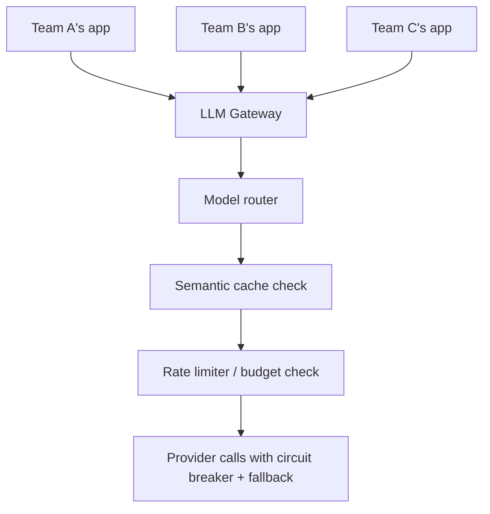

Every capability from this month — routing, fallback, caching, rate limiting — is more valuable as shared infrastructure than as logic duplicated across every team's application code. This post assembles them into one internal gateway service every team calls instead of hitting provider APIs directly.

## Why a Gateway, Not Direct Provider Calls



A gateway centralizes every cross-cutting concern this month covered — routing, caching, rate limiting, provider fallback, cost attribution (tomorrow's post) — so individual teams write application logic against one consistent internal API, without each reimplementing the same infrastructure.

## The Gateway API Surface

```python
from fastapi import FastAPI, Depends

app = FastAPI()

@app.post("/v1/generate")
async def generate(request: GenerateRequest, team: str = Depends(authenticate_team)):
    if not rate_limiter.check_and_consume(team, request.estimated_tokens):
        raise HTTPException(429, "Rate limit exceeded")

    cached = semantic_cache_lookup(request.prompt)
    if cached:
        log_cache_hit(team, request)
        return cached

    model = router.route({"task_type": request.task_type, "team": team})
    result = await generate_with_fallback({"model": model, **request.dict()})

    log_usage(team=team, model=model, tokens=result["usage"], cost=calculate_cost(model, result["usage"]))
    semantic_cache_store(request.prompt, result)
    return result
```

This single endpoint composes essentially every technique from this month — the model router (yesterday), semantic caching (August's earlier post), rate limiting (this week), provider fallback (yesterday), and usage logging feeding directly into tomorrow's cost attribution post.

## Team-Level Configuration

```python
team_configs = {
    "support-agent-team": {"default_model_tier": "fast", "monthly_budget_usd": 5000, "allowed_models": ["claude-haiku-4-5", "claude-sonnet-5"]},
    "research-team": {"default_model_tier": "capable", "monthly_budget_usd": 20000, "allowed_models": ["*"]},
}
```

Per-team configuration — budget limits, allowed models, default routing tier — lets a platform team enforce organization-wide policy (cost control, approved model list) centrally, without needing every application team to independently implement and remember to apply the same policies.

## Authentication and Audit Logging

```python
async def authenticate_team(api_key: str = Header(...)) -> str:
    team = validate_api_key(api_key)
    if not team:
        raise HTTPException(401, "Invalid API key")
    return team

def log_request_for_audit(team: str, request: dict, response: dict):
    audit_log.record({
        "team": team, "timestamp": now(), "model": response["model"],
        "prompt_hash": hashlib.sha256(request["prompt"].encode()).hexdigest(),  # hash, not raw prompt, for privacy
        "tokens": response["usage"], "cost": response["cost"],
    })
```

Per-team API keys and structured audit logging are what make the cost attribution and compliance requirements from later posts this year (September's security series, November's business-of-AI series) tractable — retrofitting this after the fact across many already-deployed applications is far more painful than building it into the gateway from the start.

## Versioning the Gateway API

Treat the gateway's own API as a stable, versioned contract (`/v1/generate`) independent of which underlying provider or model serves a given request — this is what lets the platform team swap providers, add new routing logic, or change caching strategy without requiring every downstream team to change their integration code.

## Operating the Gateway Itself

The gateway is now a critical, shared piece of infrastructure — apply every reliability pattern from this month to it directly: its own health checks, its own autoscaling, its own multi-region deployment if latency demands it, and its own disaster recovery plan, since a gateway outage now affects every team depending on it simultaneously.

---

*Part of the [AI Infrastructure series]({{ site.baseurl }}/tags/ai-infra-series/) — next: [token budget management across a multi-team organization]({{ site.baseurl }}/posts/token-budget-management-multi-team/), building directly on the gateway's team configuration.*
