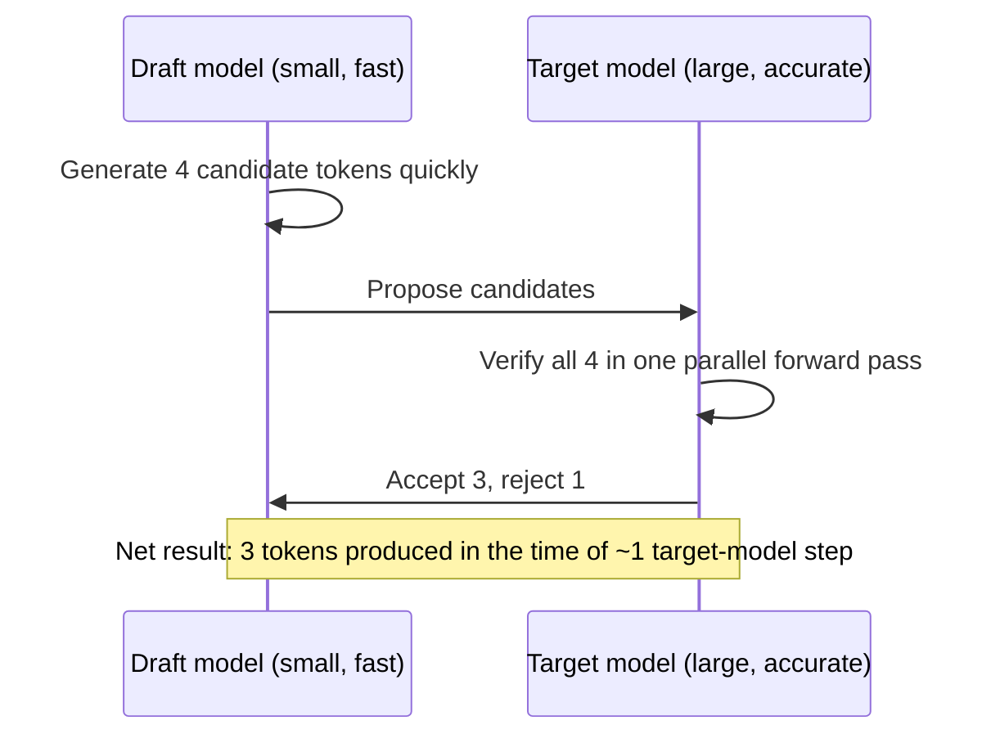

Every optimization so far this month has worked at the system level — batching, caching, routing. Speculative decoding works at the model-inference-algorithm level, and it's one of the more counter-intuitive techniques in this series: using a *second* model to make the primary model faster.

## The Core Idea



A small, fast "draft" model generates several candidate tokens quickly and cheaply. The large "target" model then verifies all those candidates in a *single* forward pass (verification is parallelizable in a way sequential generation isn't) — accepting the ones that match what it would have generated itself, and only falling back to its own generation for the first rejected token onward.

## Why Verification Is Cheaper Than Generation

Decode-phase generation (from the KV cache post) is memory-bandwidth-bound — one token at a time, repeatedly reading model weights from memory. Verifying several draft tokens at once is more like the prefill phase — compute-bound, and GPUs have compute headroom that pure sequential decoding doesn't use efficiently. Speculative decoding exploits exactly that idle compute capacity.

## Using Speculative Decoding in vLLM

```python
from vllm import LLM

llm = LLM(
    model="meta-llama/Llama-3-70b-Instruct",
    speculative_config={
        "model": "meta-llama/Llama-3-8b-Instruct",  # smaller draft model from the same family
        "num_speculative_tokens": 5,
    },
)
```

Using a smaller model from the *same model family* as the draft model is the common default — a draft model trained similarly to the target is far more likely to produce candidates the target model would actually generate, maximizing the acceptance rate that determines the real speedup.

## Acceptance Rate Determines the Actual Speedup

```python
def measure_acceptance_rate(generation_trace: list[dict]) -> float:
    accepted = sum(step["accepted_tokens"] for step in generation_trace)
    proposed = sum(step["proposed_tokens"] for step in generation_trace)
    return accepted / proposed
```

A high acceptance rate (draft model's guesses frequently match the target) yields close to the theoretical speedup; a low acceptance rate (draft and target diverge often) yields little benefit and can even add overhead from the wasted draft generation. This is workload-dependent — measure it on your actual traffic rather than assuming a published benchmark number transfers.

## Self-Speculative Decoding: No Second Model Needed

Some implementations skip the separate draft model entirely, using an early layer's output within the same model as a cheap draft, verified by the full model — avoiding the operational overhead of deploying and maintaining two separate models, at some speedup cost relative to a well-matched dedicated draft model.

## When Speculative Decoding Is Worth the Added Complexity

It's most valuable for latency-sensitive workloads (interactive chat, the voice pipelines from July) running a large target model where per-token decode latency directly drives user-perceived responsiveness. For throughput-optimized batch workloads already saturating GPU compute through large batch sizes, the benefit is smaller — the compute headroom speculative decoding exploits is already being used by the large batch itself.

## Combining With Everything Else This Month

Speculative decoding composes with continuous batching, quantization, and the other techniques covered this month — it's not a replacement for them, but an additional lever, and the combined effect on real workloads is worth benchmarking together rather than evaluating each technique's contribution in isolation.

---

*Part of the [AI Infrastructure series]({{ site.baseurl }}/tags/ai-infra-series/) — next: [batch inference pipelines for offline workloads]({{ site.baseurl }}/posts/batch-inference-pipelines-offline/), where the throughput-optimized side of this month's tradeoffs takes priority.*
